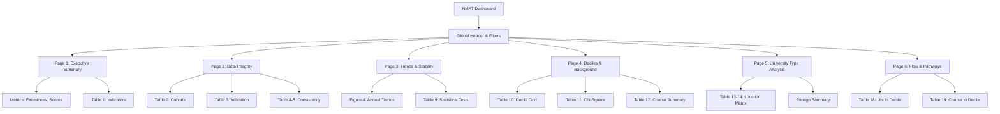

# NMAT Performance Dashboard, 2006–2018

**Caption**: Descriptive, trend-based, and policy-oriented summaries based on the cleaned NMAT_Ultima pipeline.

## 📖 Read this first: how to interpret the dashboard

- **Best-record pages**: Show one NMAT record per examinee (the one with the highest score).
- **Trend pages**: Cover NMAT years 2006–2018.
- **PLE-linked pages**: Use the observable cohort only (examinees from years where professional licensure data is reliably available).
- **Confirmed PLE outcomes**: Refer to records where `IS_PLE_ANALYSIS_SAFE == True`.
- **Course groups**: Sourced from the `CourseGroup` field:
  - **Medical & Allied**: Medical, Nursing, Pharmacy, Health-related.
  - **Natural Sciences**: Biology, Physics, Chemistry, Natural Sciences.
  - **Social & Behavioral Sciences**: Psychology, Economics, Social Sciences.
  - **Engineering & Technology**: Engineering, Technology fields.
  - **Education**: Teacher training, Education programs.
  - **Other**: All remaining courses.

## 🛠️ Global Filters (Sidebar)

- **Year Range**: 2006–2018
- **University Types**: Foreign, Not Specified, Private, Public
- **Course Groups**: Education, Engineering & Technology, Medical & Allied, Natural Sciences, Other, Social & Behavioral Sciences
- **Sex**: Female, Male
- **Source File**: `dataset\NMAT_Ultima.parquet`

---

# 🏠 Executive Summary

### Overview

**Metrics:**

- **Best-record examinees:** 133,766
- **Years covered:** 13
- **Median TRUE raw score:** 122.0
- **Median percentile rank:** 50.0
- **Unique examinees:** 133,521
- **Repeat takers:** 33,711
- **Observable cohort size:** 64,463
- **Confirmed PLE share in observable cohort:** 45.40%

### 📚 **Course Group Distribution**

Course groups are sourced directly from the cleaned pipeline output (`CourseGroup`):

- **Medical & Allied**: Medical, Nursing, Pharmacy, Health-related
- **Natural Sciences**: Biology, Physics, Chemistry, Natural Sciences
- **Social & Behavioral Sciences**: Psychology, Economics, Social Sciences
- **Engineering & Technology**: Engineering, Technology fields
- **Education**: Teacher training, Education programs
- **Other**: All remaining courses

### Figure 1. Annual NMAT score and volume profile

This figure combines median TRUE raw score, Part I and Part II medians, median percentile rank, and examinee count by year. Use it to see whether performance and testing volume moved together or in opposite directions over time.

### Figure 2. Course-group composition of best-record examinees

*Placeholder: (Insert Pie Chart showing counts of filtered best-record examinees by category.)*

### Figure 3. University-type composition of best-record examinees

*Placeholder: (Insert Pie Chart showing percent shares of filtered cohort.)*

### Table 1. Executive summary indicators

| Indicator                   | Value  |
| --------------------------- | ------ |
| Median Total Raw Score      | 122.00 |
| Median Part I Raw Score     | 65.00  |
| Median Part II Raw Score    | 57.00  |
| Median Percentile Rank      | 50.00  |
| Top-decile share (D8-D10)   | 30.01% |
| Bottom-decile share (D1-D3) | 30.24% |

---

# 🧪 Data Integrity

### Cohort Definition Checks

**Metrics:**

- **All NMAT rows:** 178,882
- **Best-record rows:** 133,766
- **Rows with TRUE raw scores:** 178,882
- **Observable best-record rows:** 64,463

### Table 2. Analysis cohorts used in the dashboard

| Analytic subset                               | Row count | Interpretation                                |
| --------------------------------------------- | --------- | --------------------------------------------- |
| All cleaned NMAT rows                         | 178,882   | All cleaned NMAT rows                         |
| One best NMAT record per person               | 133,766   | One best NMAT record per person               |
| Best-record rows within 2006–2018             | 133,766   | Best-record rows within 2006–2018             |
| Best-record rows in the observable PLE window | 64,463    | Best-record rows in the observable PLE window |
| Confirmed PLE-matched NMAT rows               | 49,976    | Confirmed PLE-matched NMAT rows               |
| Confirmed PLE-matched best-record persons     | 36,301    | Confirmed PLE-matched best-record persons     |

### Table 3. TRUE raw-score validation checks

| Validation check                              | Count of rows |
| --------------------------------------------- | ------------- |
| Rows with complete Total + Part I + Part II   | 178,882       |
| Formula mismatches: Total != Part I + Part II | 0             |
| Stored-vs-derived mismatch flag count         | 0             |
| Calc-vs-derived mismatch flag count           | 0             |

### Table 4 & 5. Institutional Consistency & Pairing Audit

**Institutional Integrity Metrics:**

- **Colleges checked:** 3,213
- **Colleges with >1 type:** 0
- **Universities checked:** 2,399
- **University pairing conflicts:** 2

**Pairing Conflicts Detail:**

| UNIVERSITY          | records | n_uni_types | n_locations | uni_types | locations |
| ------------------- | ------- | ----------- | ----------- | --------- | --------- |
| VELEZ COLLEGE       | 2,970   | 2           | 2           | Foreign   | Private   |
| NEW YORK UNIVERSITY | 11      | 2           | 2           | Foreign   | Private   |

### Core Distributions

| University Type | Count   |
| --------------- | ------- |
| Private         | 135,484 |
| Public          | 37,555  |
| Foreign         | 4,011   |
| Not Specified   | 1,832   |

| Course Group                 | Count  |
| ---------------------------- | ------ |
| Medical & Allied             | 86,121 |
| Natural Sciences             | 55,889 |
| Social & Behavioral Sciences | 22,021 |
| Other                        | 9,845  |
| Education                    | 4,158  |
| Engineering & Technology     | 848    |

| PLE Status (Filtered Rows) | Count   |
| -------------------------- | ------- |
| No confirmed PLE match     | 128,906 |
| Confirmed PLE passer       | 49,976  |

---

# 📈 Trends & Stability

### Figure 4. Annual score trends and examinee volume

**References:**

- **Overall Trends:** `dataset\analysis_output\01A_overall_trend_raw_and_percentile.png`
- **Part I/II Trends:** `dataset\analysis_output\01C_parti_partii_trend.png`
- **Examinee Volume:** `dataset\analysis_output\XX_examinee_count_by_year.png`

### Table 9. Kruskal-Wallis tests for year-to-year score differences

| Score              | H        | p_value | eta_squared |
| ------------------ | -------- | ------- | ----------- |
| Total Raw Score    | 5598.2   | <0.001  | 0.0418      |
| Part I Raw Score   | 5453.439 | <0.001  | 0.0407      |
| Part II Raw Score  | 5515.988 | <0.001  | 0.0412      |
| Percentile Rank    | 2235.74  | <0.001  | 0.0168      |
| GPS Standard Score | 2420.314 | <0.001  | 0.018       |

---

# 📊 Deciles & Background

### Table 10. Count of examinees in each decile by NMAT year

| PercentileDecile | 2006 | 2007 | 2008 | 2009 | 2010 | 2011 | 2012 | 2013 | 2014 | 2015 | 2016 | 2017 | 2018 |
| ---------------- | ---- | ---- | ---- | ---- | ---- | ---- | ---- | ---- | ---- | ---- | ---- | ---- | ---- |
| D10              | 426  | 401  | 630  | 784  | 1166 | 849  | 1396 | 1673 | 1650 | 1262 | 1012 | 1653 | 1796 |
| D9               | 388  | 415  | 535  | 713  | 959  | 910  | 893  | 984  | 1143 | 1050 | 1182 | 2012 | 1805 |
| D8               | 363  | 365  | 467  | 656  | 815  | 925  | 783  | 860  | 1002 | 936  | 1264 | 2248 | 1774 |
| D7               | 357  | 358  | 462  | 630  | 733  | 846  | 775  | 769  | 943  | 1021 | 1143 | 2160 | 1789 |
| D6               | 365  | 302  | 508  | 710  | 798  | 890  | 837  | 740  | 991  | 1053 | 1327 | 2379 | 2188 |
| D5               | 352  | 363  | 479  | 672  | 836  | 1038 | 897  | 720  | 827  | 918  | 1266 | 2050 | 2145 |
| D4               | 368  | 404  | 467  | 725  | 753  | 1001 | 727  | 533  | 642  | 664  | 1174 | 2778 | 2228 |
| D3               | 350  | 364  | 392  | 682  | 716  | 821  | 721  | 564  | 706  | 664  | 915  | 2210 | 2138 |
| D2               | 302  | 298  | 431  | 651  | 647  | 750  | 768  | 698  | 719  | 759  | 1166 | 2844 | 2512 |
| D1               | 371  | 365  | 460  | 619  | 562  | 643  | 1061 | 1168 | 1362 | 1487 | 1821 | 3285 | 3462 |

### Table 11. Chi-square test (University Type x Decile)

| chi2      | p_value | df  | n_observations | cramers_v |
| --------- | ------- | --- | -------------- | --------- |
| 1090.8872 | <0.001  | 18  | 129,348        | 0.0649    |

### Table 12. Percentile summary by course group

| CourseGroup                  | n      | median | q25  | q75  |
| ---------------------------- | ------ | ------ | ---- | ---- |
| Education                    | 3256   | 51.0   | 26.0 | 78.0 |
| Engineering & Technology     | 730    | 72.0   | 41.0 | 91.0 |
| Medical & Allied             | 63,419 | 49.0   | 25.0 | 73.0 |
| Natural Sciences             | 40,841 | 54.0   | 23.0 | 81.0 |
| Other                        | 7934   | 53.0   | 26.0 | 79.0 |
| Social & Behavioral Sciences | 16,365 | 39.0   | 11.0 | 73.0 |

---

# 🏫 University Type Analysis

### Table 13. Institution type by location mix

| UNI_TYPE | UNI_LOCATION  | Count  | Percent of Total |
| -------- | ------------- | ------ | ---------------- |
| Foreign  | International | 3,218  | 2.49%            |
| Private  | Local         | 99,026 | 76.56%           |
| Public   | International | 326    | 0.25%            |
| Public   | Local         | 26,778 | 20.70%           |

### Table 14. Institution type by location matrix

**Counts (with totals):**

| UNI_TYPE | International | Local       | All         |
| -------- | ------------- | ----------- | ----------- |
| Foreign  | 3,218         | 0           | 3,218       |
| Private  | 0             | 99,026      | 99,026      |
| Public   | 326           | 26,778      | 27,104      |
| **All**  | **3,544**     | **125,804** | **129,348** |

**Column percentages: within UNI_LOCATION:**

| UNI_TYPE | International | Local  |
| -------- | ------------- | ------ |
| Foreign  | 90.80%        | 0.00%  |
| Private  | 0.00%         | 78.71% |
| Public   | 9.20%         | 21.29% |

**Row percentages: within UNI_TYPE:**

| UNI_TYPE | International | Local   |
| -------- | ------------- | ------- |
| Foreign  | 100.00%       | 0.00%   |
| Private  | 0.00%         | 100.00% |
| Public   | 1.20%         | 98.80%  |

### ### Foreign Examinee Summary

- **Foreign examinees:** 3,218
- **% of total:** 2.49%
- **Median percentile:** 51.0
- **Top decile %:** 30.33%

### Figure 16. Medical and allied versus other courses by university type

| UNI_TYPE | Medical & Allied | Other Courses |
| -------- | ---------------- | ------------- |
| Foreign  | 49.35%           | 50.65%        |
| Private  | 49.98%           | 50.02%        |
| Public   | 41.80%           | 58.20%        |

---

# 🔄 Flow & Pathways

### Table 18. University-type to decile flow counts

| UNI_TYPE | Decile | Count  |
| -------- | ------ | ------ |
| Public   | D1     | 3,218  |
| Public   | D2     | 2,297  |
| Public   | D3     | 2,065  |
| Public   | D4     | 2,267  |
| Public   | D5     | 2,339  |
| Public   | D6     | 2,499  |
| Public   | D7     | 2,398  |
| Public   | D8     | 2,585  |
| Public   | D9     | 2,973  |
| Public   | D10    | 4,463  |
| Private  | D1     | 12,857 |
| Private  | D2     | 9,809  |
| Private  | D3     | 8,781  |
| Private  | D4     | 9,759  |
| Private  | D5     | 9,775  |
| Private  | D6     | 10,139 |
| Private  | D7     | 9,164  |
| Private  | D8     | 9,445  |
| Private  | D9     | 9,550  |
| Private  | D10    | 9,747  |
| Foreign  | D1     | 405    |
| Foreign  | D2     | 284    |
| Foreign  | D3     | 286    |
| Foreign  | D4     | 337    |
| Foreign  | D5     | 296    |
| Foreign  | D6     | 329    |
| Foreign  | D7     | 305    |
| Foreign  | D8     | 306    |
| Foreign  | D9     | 335    |
| Foreign  | D10    | 335    |

### Table 19. Course-group to decile flow counts

| CourseGroup         | Decile | Count |
| ------------------- | ------ | ----- |
| Medical & Allied    | D1     | 6,875 |
| Medical & Allied    | D2     | 6,316 |
| Medical & Allied    | D3     | 5,927 |
| Medical & Allied    | D4     | 6,671 |
| Medical & Allied    | D5     | 6,845 |
| Medical & Allied    | D6     | 6,934 |
| Medical & Allied    | D7     | 6,035 |
| Medical & Allied    | D8     | 6,083 |
| Medical & Allied    | D9     | 5,751 |
| Medical & Allied    | D10    | 5,619 |
| Natural Sciences    | D1     | 5,243 |
| Natural Sciences    | D2     | 3,485 |
| Natural Sciences    | D3     | 2,956 |
| Natural Sciences    | D4     | 3,378 |
| Natural Sciences    | D5     | 3,345 |
| Natural Sciences    | D6     | 3,703 |
| Natural Sciences    | D7     | 3,722 |
| Natural Sciences    | D8     | 3,971 |
| Natural Sciences    | D9     | 4,457 |
| Natural Sciences    | D10    | 5,816 |
| Social & Behavioral | D1     | 3,299 |
| Social & Behavioral | D2     | 1,730 |
| Social & Behavioral | D3     | 1,329 |
| Social & Behavioral | D4     | 1,296 |
| Social & Behavioral | D5     | 1,231 |
| Social & Behavioral | D6     | 1,362 |
| Social & Behavioral | D7     | 1,149 |
| Social & Behavioral | D8     | 1,230 |
| Social & Behavioral | D9     | 1,396 |
| Social & Behavioral | D10    | 1,701 |
| Education           | D1     | 347   |
| Education           | D2     | 294   |
| Education           | D3     | 310   |
| Education           | D4     | 318   |
| Education           | D5     | 334   |
| Education           | D6     | 286   |
| Education           | D7     | 301   |
| Education           | D8     | 296   |
| Education           | D9     | 332   |
| Education           | D10    | 422   |
| Engineering & Tech  | D1     | 45    |
| Engineering & Tech  | D2     | 41    |
| Engineering & Tech  | D3     | 46    |
| Engineering & Tech  | D4     | 43    |
| Engineering & Tech  | D5     | 59    |
| Engineering & Tech  | D6     | 66    |
| Engineering & Tech  | D7     | 53    |
| Engineering & Tech  | D8     | 75    |
| Engineering & Tech  | D9     | 110   |
| Engineering & Tech  | D10    | 191   |
| Other               | D1     | 857   |
| Other               | D2     | 679   |
| Other               | D3     | 675   |
| Other               | D4     | 758   |
| Other               | D5     | 749   |
| Other               | D6     | 737   |
| Other               | D7     | 726   |
| Other               | D8     | 803   |
| Other               | D9     | 943   |
| Other               | D10    | 949   |

---

## Mermaid Diagram: Dashboard Structure

*Note: The following pages are outlined in `dashboard.py` and will be populated once data is extracted:*  
7. 🎯 PLE Alignment  
8. 🔁 Repeat Takers  
9. 🧠 Subtests & Profiles  
10. ⏰ Year Gap & Gender  
11. 📐 Statistical Tests  
12. 📋 Policy Tables & Export