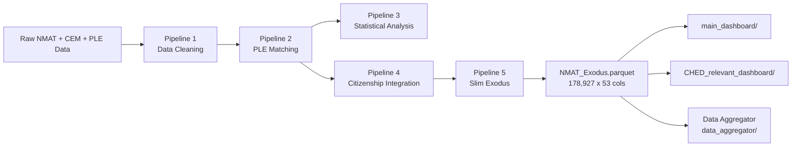

# NMAT Analysis Pipeline

**Descriptive and trend-based analysis of the Philippine National Medical Admission Test (NMAT), linked to Philippine Licensure Examination (PLE) outcomes and citizenship data.**

**Final dataset:** `dataset/NMAT_Exodus.parquet` (178,927 rows × 53 columns), md5 `28b85ac53af13b4a2ef3ee93527c97c1`, present as 3 byte-identical copies (`dataset/` + both live dashboard folders).

> **2026-08 remediation notice.** This README was rewritten against the corrected pipeline and
> schema. If you have an older copy of this project's documentation, note two corrections in
> particular: the pipeline chain is **5 stages, not 4** (`5_Slim_Exodus.py` is new), and the PLE
> matcher had a hard percentile-floor bug (fixed) that suppressed matches for exactly the
> below-40th-percentile population this project studies — see `docs/pipeline_architecture.md` §7
> for what changed and which older headline numbers it supersedes.

---

## Table of Contents

1. [Project Overview](#project-overview)
2. [Pipeline Architecture](#pipeline-architecture)
3. [System Requirements](#system-requirements)
4. [Installation & Setup](#installation--setup)
5. [Running the Pipeline](#running-the-pipeline)
6. [Dashboards](#dashboards)
7. [Key Decisions & Issues Faced](#key-decisions--issues-faced)
8. [Output Structure](#output-structure)
9. [Data Dictionary](#data-dictionary)
10. [License & Attribution](#license--attribution)

---

## Project Overview

### Objective

This project produces **descriptive and trend-based analysis reports** on NMAT performance, focusing on:

- **NMAT Score Trends** across exam years (2006–2018)
- **Distributional Analysis** using percentile bins (B1–B10)
- **Performance Stability** across years and repeat test-takers
- **Background-Based Comparisons** by university type, course group, and pre-med background
- **PLE Alignment** with Philippine Licensure Examination outcomes
- **Citizenship Analysis** using ground-truth foreigner data (REAL_FOREIGNERS.csv)

### What This Pipeline Does NOT Include

- Causal inference or predictive modeling
- Real-time data collection or scoring
- Extension of NMAT–PLE matching logic (uses existing deterministic matches only)

---

## Pipeline Architecture

The project uses **5 sequential pipelines** to transform raw data into the final analytic dataset.
Full detail, including two root-cause defects found and fixed in remediation, is in
`docs/pipeline_architecture.md` — this section is a summary.



### Pipeline 1: Data Cleaning (`1_Data_Cleaning_Pipeline.ipynb`)

**Inputs:** `NMAT_CLEANED_DATA.csv`, `CEM_DATA.csv`, `UNIVS.csv`

**Key operations:**
- Clean and standardize application numbers
- Normalize university names via 4-tier matching against UNIVS.csv (2,981 verified, 1,386 unmatched) — the only fuzzy (`rapidfuzz`) matching anywhere in the project
- Recalculate TRUE raw scores from 8 component subtests. Stored totals disagree with the recalculated total in **56.45% of the 99,316 records that carry a stored total** (31.33% of all rows). The "42.2%" figure seen elsewhere is also correct — it is the same mismatch measured over the whole CEM file (107,422 of 254,308 rows). Neither supersedes the other; always name the denominator. CEM had already flagged these rows itself via `STU_RSCORE_VALID`.
- Classify universities as Public/Private/Foreign, course groups into 6 categories
- Create `PercentileBin` bins (B1–B10, B1 = lowest decile)
- **Output:** `NMAT_FINAL.csv` (101 columns) — the file Pipeline 2 reads. A `NMAT_FINAL.parquet` twin was removed in a 2026-08 dataset-hygiene cleanup; it had no readers.

### Pipeline 2: PLE Matching (`2_PLE_Matching_Pipeline.ipynb`)

**Inputs:** `NMAT_FINAL.csv`, `PLE_DATA.csv`, `PLE_UNMATCHED.csv`, `PLE_STILL_UNMATCHED.csv`

**Key operations:**
- **Deterministic-only matching** — no fuzzy/rapidfuzz matching in this pipeline
- 3-stage cascade: Manual AppNo recovery → Exact name match → Deterministic AppNo
- Disambiguator for multiple candidates: year-gap → DOB/sex → latest year → **exactly one survivor accepted, two or more rejected as ambiguous**. Earlier versions of this pipeline had a hard percentile-floor step and a score-based tie-break here; both were identity-resolution bugs that pushed matching decisions onto the very outcome variable this project studies. Both are removed — see `docs/pipeline_architecture.md` §7 for the fix and its measured effect.
- **Results:** `IS_PLE_PASSER = 49,086` (49,986 was the pre-fix figure; if you see 49,986 elsewhere it predates this fix)
- **Output:** `NMAT_Ultima.parquet` (119 columns), `PLE_MATCH_MASTER.csv`

### Pipeline 3: Statistical Analysis (`3_NMAT_PLE_Analysis.ipynb`)

**Input:** `NMAT_Ultima.parquet`

**13 analysis sections** producing ~95 output files (CSV + PNG) to `dataset/analysis_output/`:
yearly trends & stability (Kruskal-Wallis), bin distributions by background (Chi-square), Sankey
flow pathways, PLE alignment (Mann-Whitney U), repeat-taker trajectories, subtest profiles, gender
analysis (Mann-Whitney U), Dunn post-hoc tests, and policy summary tables. This pipeline is
analysis-only — it is not on the path that produces the shipped `NMAT_Exodus.parquet`.

### Pipeline 4: Citizenship Integration (`4_Citizenship_Integration.py`)

**Inputs:** `NMAT_Ultima.parquet`, `REAL_FOREIGNERS.csv`, `pseudo_citizenship_profiling_FINAL.csv`

Implements a **3-tier hierarchy of truth:**

| Tier | Source | Records | FOREIGNER_STATUS |
|:----:|--------|--------:|------------------|
| 1 | REAL_FOREIGNERS.csv (known nationality) | 32,345 | Verified Foreigner |
| 1b | REAL_FOREIGNERS.csv (ambiguous → "Foreign (unspecified)") | 156 | Verified Foreigner |
| 2 | Pseudo-citizenship (FOREIGN override) | 13 | Likely Foreigner |
| 3 | Default Filipino | 146,413 | Filipino |

**Output:** `NMAT_Exodus.parquet.bak` — a wide (118-column) intermediate. This is **not** the
shipped file.

### Pipeline 5: Slim Exodus (`5_Slim_Exodus.py`) — new

Reads `NMAT_Exodus.parquet.bak`, selects/renames/coerces to the 53-column shipped schema, and
writes the canonical `dataset/NMAT_Exodus.parquet` plus byte-identical copies into both live
dashboard folders. Before this script existed, the shipped file's column selection had **no
generating code at all** — it was hand-picked once and described only in prose. This script makes
that step explicit, deterministic, and self-verifying: it asserts structural invariants (row/col
counts, one best-record per person, dropped columns actually absent) and warns — without
blocking — on drift in reference headline numbers, recording both in
`dataset/EXODUS_MANIFEST.json`.

**Result:** 118 → 53 columns, 3 byte-identical copies, md5 `28b85ac53af13b4a2ef3ee93527c97c1`.

---

## System Requirements

### Minimum Hardware
- **RAM:** 8 GB minimum (16 GB recommended for re-running pipelines)
- **Disk Space:** 1 GB free (for outputs)

### Software
- **Python:** 3.8+ (3.10+ recommended)
- **OS:** Windows, macOS, or Linux

### Dependencies (install via `requirements.txt`)
```
pandas numpy pyarrow scipy scikit-posthocs plotly streamlit
```

---

## Installation & Setup

### 1. Create Virtual Environment

```powershell
# Windows (PowerShell)
python -m venv .venv
.\.venv\Scripts\Activate.ps1
```

```bash
# macOS/Linux
python3 -m venv .venv
source .venv/bin/activate
```

### 2. Install Dependencies

```bash
pip install -U pip setuptools wheel
pip install -r requirements.txt
```

### 3. Data Files

All data files go in `dataset/`. The final analytic file is `NMAT_Exodus.parquet` (53 columns).
The only full-column backup is `NMAT_Exodus.parquet.bak` (118 columns) — deliberately retained as
the sole full-width audit trail; do not delete it. See `dataset/DATASET_MANIFEST.md` for the
complete file-by-file classification (live input / regenerated / stale / dead) if you need to know
whether a specific file in `dataset/` is safe to touch.

---

## Running the Pipeline

### Option A: Quick Start (Skip Pipeline — Use an Existing Dashboard)

```bash
cd streamlit_dashboard/main_dashboard
streamlit run dashboard.py
```
or
```bash
cd streamlit_dashboard/CHED_relevant_dashboard
streamlit run dashboard.py
```
Both read directly from their own copy of `dataset/NMAT_Exodus.parquet` (byte-identical to the
canonical one). No pipeline re-run needed.

### Option B: One-Click Dependency Install

`00_RUN_ME.ipynb` is a convenience notebook that installs all required Python packages in one shot:

```bash
jupyter notebook 00_RUN_ME.ipynb
```

Run this first if setting up from scratch. If you already installed via `requirements.txt`, you can skip it.

### Option C: Re-run the Full Pipeline Chain (1→2→3→4→5)

```bash
# Pipelines 1–3 (notebooks)
jupyter notebook 1_Data_Cleaning_Pipeline.ipynb
jupyter notebook 2_PLE_Matching_Pipeline.ipynb
jupyter notebook 3_NMAT_PLE_Analysis.ipynb    # analysis-only, not required for the dashboards

# Pipeline 4 (citizenship enrichment)
.venv\Scripts\python.exe 4_Citizenship_Integration.py

# Pipeline 5 (slim to the shipped 53-column schema; writes both dashboard copies + manifest)
.venv\Scripts\python.exe 5_Slim_Exodus.py
```
Pipeline 5 must run after Pipeline 4 and before the dashboards will see updated data — it is the
step that actually produces `dataset/NMAT_Exodus.parquet`.

### Option D: Run Data Aggregator (Generate Static Reports)

```bash
.venv\Scripts\python.exe data_aggregator/run_all.py
```
Runs from the repo root or from inside `data_aggregator/` — both resolve paths relative to the
script, not the working directory. Produces 13 markdown reports in `data_aggregator/page_results/`
(13/13 expected).

### Verify

```bash
.venv\Scripts\python.exe -m pytest tests/ -q
```
36 passed is the expected, current state.

---

## Dashboards

**Two live dashboards** consume `NMAT_Exodus.parquet` directly:

### Main Dashboard (`streamlit_dashboard/main_dashboard/dashboard.py`)

```bash
cd streamlit_dashboard/main_dashboard
streamlit run dashboard.py
```

**12 pages:** Executive Summary, Data Integrity, Trends & Stability, Score Bins & Background,
University Type, Flow & Pathways, PLE Alignment, Repeat Takers, Subtests & Profiles, Year Gap &
Gender, Statistical Tests, Policy Tables & Export.

**Features:** sidebar filters (Year, University Type, Course Group, Sex, PLE Status), interactive
Plotly charts, CSV download buttons, citizenship section using `CITIZENSHIP_FINAL` /
`FOREIGNER_STATUS`.

### CHED-Relevant Dashboard (`streamlit_dashboard/CHED_relevant_dashboard/dashboard.py`)

```bash
cd streamlit_dashboard/CHED_relevant_dashboard
streamlit run dashboard.py
```

A focused variant built around the CMO §IV.B.1 cut-off question (30th vs 40th percentile),
including the below-40th-percentile linkage finding described in `docs/pipeline_architecture.md` §7.

### Data Aggregator (`data_aggregator/`)

Not interactive — generates the same analyses as static markdown, one file per dashboard page, for
archiving or email distribution. See "Option D" above.

### Legacy — not maintained

`RShiny_Dashboard/NMAT_Shiny/app.R`, `RShiny_Dashboard/NMAT_Shiny/NMAT_Dashboard_v2.Rmd`,
`reports/`, and the root `dashboard.py` / `dashboard.py.bak` are **retained for reference only**.
They predate the schema/matcher remediation described in `docs/pipeline_architecture.md` and have
not been updated against the current 53-column schema or the corrected PLE matcher. Do not run
them expecting current numbers, and do not treat them as a maintained parity target for new
dashboard work.

---

## Key Decisions & Corrections

| Decision / correction | Detail |
|----------|---------|
| **Deterministic-only PLE matching** | No fuzzy/`rapidfuzz` matching in Pipeline 2 (university-name matching in Pipeline 1 still uses it — see `docs/pipeline_architecture.md`). |
| **No score-based identity resolution** | A hard percentile-floor step in the PLE disambiguator (RC-0) was found to be suppressing matches for exactly the below-40th-percentile population under study, and was removed. See `docs/pipeline_architecture.md` §7. |
| **TRUE raw score recalculation** | Stored raw score totals disagree with the recalculated total in 56.45% of the 99,316 records that carry a stored total (the "42.2%" figure is the same mismatch over the whole CEM file, 107,422/254,308 — a different population, not an error). |
| **5-pipeline chain** | Pipeline 5 (`5_Slim_Exodus.py`) is new — it gives the previously code-less 118→53 column slim an explicit, asserted, reproducible implementation. |
| **`REAL_FOREIGNERS.csv` integration** | Pipeline 4 implements a 3-tier citizenship hierarchy with `REAL_FOREIGNERS.csv` as ground truth. |
| **Observable cohort, done correctly** | Use `IS_BEST_OBSERVABLE_RECORD` (69,503 people), never `IS_BEST_NMAT_RECORD & (Year <= 2014)` (65,782 — silently drops 3,721 people). |
| **Best-record deduplication, unified rule** | `IS_BEST_NMAT_RECORD` now applies one selection rule to every person (highest percentile → latest year → lowest AppNo), not a different rule for PLE passers than for everyone else. |
| **`UNDERGRAD_*` renames** | `UNIVERSITY`/`UNI_TYPE`/`UNI_LOCATION`/`CourseGroup` renamed to make explicit that this data describes the applicant's undergraduate degree — there is no medical-school identifier anywhere in the dataset. |
| **Column slimming** | 118 → 53 columns in the shipped file (see `docs/data_dictionary.md` for the exact removed/renamed/added list). |

---

## Output Structure

```
dataset/
├── NMAT_Exodus.parquet             # Final dataset (53 cols), + 2 byte-identical copies in the dashboard folders
├── NMAT_Exodus.parquet.bak         # Full 118-column audit-trail backup — the only one; do not delete
├── EXODUS_MANIFEST.json            # Written by 5_Slim_Exodus.py: row/col counts, md5, column list, reference-count deltas
└── DATASET_MANIFEST.md             # File-by-file classification of everything in dataset/

docs/
├── pipeline_architecture.md        # Full 5-pipeline documentation with Mermaid charts
└── data_dictionary.md              # Comprehensive 53-column data dictionary

data_aggregator/
├── aggregate_all.py                # Concatenates the 13 page outputs into 00_MASTER_REPORT.md
├── run_all.py                      # Entry point — runs all 13 pages
├── page_01_*.py through page_13_*.py
└── page_results/                   # Generated markdown reports

streamlit_dashboard/
├── main_dashboard/dashboard.py             # Live
└── CHED_relevant_dashboard/dashboard.py    # Live

tests/
└── test_data_invariants.py         # pytest, 36 passed expected; asserts the schema contract

RShiny_Dashboard/, reports/, dashboard.py   # Legacy, not maintained — see "Dashboards" above
```

---

## Data Dictionary

See `docs/data_dictionary.md` for the complete 53-column dictionary with descriptions, verified
value counts, and the removed/renamed/added column list versus the pre-remediation 54-column file.

---

## License & Attribution

### License

Copyright (C) 2026 NMAT Analysis Project

This program is free software: you can redistribute it and/or modify it under the terms of the GNU General Public License as published by the Free Software Foundation, either version 3 of the License, or (at your option) any later version.

This program is distributed in the hope that it will be useful, but WITHOUT ANY WARRANTY; without even the implied warranty of MERCHANTABILITY or FITNESS FOR A PARTICULAR PURPOSE. See the GNU General Public License for more details.

You should have received a copy of the GNU General Public License along with this program (`LICENSE`). If not, see <https://www.gnu.org/licenses/>.

### Data Sources

- **NMAT data:** Center for Educational Measurement (CEM), Philippines
- **PLE data:** Professional Regulation Commission (PRC), Philippines
- **University reference:** Commission on Higher Education (CHED), Philippines
- **Citizenship ground truth:** Provided by CEM as `REAL_FOREIGNERS.csv`

### Disclaimer

This analysis is for descriptive and research purposes. It is not a substitute for official policy or regulatory guidance. The authors make no claims about the accuracy, completeness, or timeliness of the underlying data. The findings are based solely on the provided datasets and should be interpreted with appropriate statistical caution.

---

*Describes the 5-pipeline NMAT Analysis system as of the 2026-08 remediation. Full architecture
documented in `docs/pipeline_architecture.md`.*
