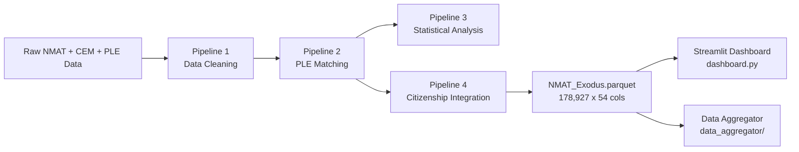

# NMAT Analysis Pipeline

**Descriptive and trend-based analysis of the Philippine National Medical Admission Test (NMAT), linked to Philippine Licensure Examination (PLE) outcomes and citizenship data.**

**Final dataset:** `dataset/NMAT_Exodus.parquet` (178,927 rows × 54 columns, 10.5 MB)

---

## Table of Contents

1. [Project Overview](#project-overview)
2. [Pipeline Architecture](#pipeline-architecture)
3. [System Requirements](#system-requirements)
4. [Installation & Setup](#installation--setup)
5. [Running the Pipeline](#running-the-pipeline)
6. [Dashboards](#dashboards)
7. [Key Decisions & Issues Faced](#key-decisions--issues-faced)
8. [Output Structure](#output-structure)
9. [Data Dictionary](#data-dictionary)
10. [License & Attribution](#license--attribution)

---

## Project Overview

### Objective

This project produces **descriptive and trend-based analysis reports** on NMAT performance, focusing on:

- **NMAT Score Trends** across exam years (2006–2018)
- **Distributional Analysis** using percentile bins (B1–B10)
- **Performance Stability** across years and repeat test-takers
- **Background-Based Comparisons** by university type, course group, and pre-med background
- **PLE Alignment** with Philippine Licensure Examination outcomes
- **Citizenship Analysis** using ground-truth foreigner data (REAL_FOREIGNERS.csv)

### What This Pipeline Does NOT Include

- Causal inference or predictive modeling
- Real-time data collection or scoring
- Extension of NMAT–PLE matching logic (uses existing deterministic matches only)

---

## Pipeline Architecture

The project uses **4 sequential pipelines** to transform raw data into the final analytic dataset:



### Pipeline 1: Data Cleaning (`1_Data_Cleaning_Pipeline.ipynb`)

**Inputs:** `NMAT_CLEANED_DATA.csv`, `CEM_DATA.csv`, `UNIVS.csv`

**Key operations:**
- Clean and standardize application numbers
- Normalize university names via 4-tier matching against UNIVS.csv (2,981 verified, 1,386 unmatched)
- Recalculate TRUE raw scores from 8 component subtests (stored totals were wrong in **42.2%** of records)
- Classify universities as Public/Private/Foreign, course groups into 6 categories
- Create `PercentileDecile` bins (D1–D10)
- **Output:** `NMAT_FINAL.parquet` (101 columns)

### Pipeline 2: PLE Matching (`2_PLE_Matching_Pipeline.ipynb`)

**Inputs:** `NMAT_FINAL.csv`, `PLE_DATA.csv`, `PLE_UNMATCHED.csv`, `PLE_STILL_UNMATCHED.csv`

**Key operations:**
- **Deterministic-only matching** (after DE-FUZZY refactor — all fuzzy/rapidfuzz matching removed)
- 3-stage cascade: Manual AppNo recovery → Exact name match → Deterministic AppNo
- 5-step disambiguator for multiple candidates: year-gap → DOB → latest year → percentile floor → tiebreak
- Binary statuses only: "Confirmed PLE passer" / "No confirmed PLE match"
- **Results:** 36,395 FINAL_MATCH (83.4% of PLE records)
- **Output:** `NMAT_Ultima.parquet` (115 columns), `PLE_MATCH_MASTER.csv`, `PLE_PASSERS_IN_NMAT.csv`

### Pipeline 3: Statistical Analysis (`3_NMAT_PLE_Analysis.ipynb`)

**Input:** `NMAT_Ultima.parquet`

**13 analysis sections** producing 95 output files (59 CSV + 36 PNG):

| Section | Analysis | Statistical Tests |
|---------|----------|-------------------|
| 1–2 | Yearly trends & stability | Kruskal-Wallis, eta-squared |
| 3–4 | Bin distributions by background | Kruskal-Wallis, Chi-square, Cramer's V |
| 5 | Sankey flow pathways | Descriptive flow % |
| 6 | PLE alignment | Mann-Whitney U, effect size r |
| 7 | Repeat taker trajectories | Descriptive |
| 8 | Subtest profiles | Mean standard scores, radar charts |
| 9 | PLE linkage by uni type | Descriptive % |
| 10 | PLE year gap | Descriptive |
| 11 | Gender analysis | Mann-Whitney U, effect size r |
| 12 | Dunn post-hoc tests | Bonferroni-adjusted |
| 13 | Policy tables | PLE alignment by year/course/uni type |

### Pipeline 4: Citizenship Integration (`4_Citizenship_Integration.py`)

**Inputs:** `NMAT_Ultima.parquet`, `REAL_FOREIGNERS.csv`, `pseudo_citizenship_profiling_FINAL.csv`

Implements a **3-tier hierarchy of truth:**

| Tier | Source | Records | FOREIGNER_STATUS |
|:----:|--------|--------:|------------------|
| 1a | REAL_FOREIGNERS.csv (known nationality) | 32,402 | Verified Foreigner |
| 1b | REAL_FOREIGNERS.csv (ambiguous nationality) | 99 | Verified Foreigner |
| 2 | Pseudo-citizenship (FOREIGN override) | 13 | Likely Foreigner |
| 3 | Default Filipino | 146,413 | Filipino |

**Key design:** Nationality canonicalization (129 raw values → 96 canonical). Cross-validation against 6 dimensions confirmed 100% key/name/year/score match.

**Output:** `NMAT_Exodus.parquet` (final dataset)

### Final Slimming: Exodus Lite

After column usage audit of both `dashboard.py` and `data_aggregator/`, **64 unused columns were removed**:
- CEM standard scores (8 cols), verification pipeline fields (12 cols), medical school choices (3 cols), personal info (8 cols), raw application fields (8 cols), college raw fields (8 cols), etc.

**Result:** 118 → 54 columns, 27.9 MB → 10.5 MB (**62.4% smaller**)

---

## System Requirements

### Minimum Hardware
- **RAM:** 8 GB minimum (16 GB recommended for re-running pipelines)
- **Disk Space:** 1 GB free (for outputs)

### Software
- **Python:** 3.8+ (3.10+ recommended)
- **OS:** Windows, macOS, or Linux

### Dependencies (install via `requirements.txt`)
```
pandas numpy pyarrow scipy scikit-posthocs plotly streamlit
```

---

## Installation & Setup

### 1. Create Virtual Environment

```powershell
# Windows (PowerShell)
python -m venv .venv
.\.venv\Scripts\Activate.ps1
```

```bash
# macOS/Linux
python3 -m venv .venv
source .venv/bin/activate
```

### 2. Install Dependencies

```bash
pip install -U pip setuptools wheel
pip install -r requirements.txt
```

### 3. Data Files

All data files go in `dataset/`. The final analytic file is `NMAT_Exodus.parquet` (54 columns). A full 118-column backup is at `NMAT_Exodus.parquet.bak`.

---

## Running the Pipeline

### Option A: Quick Start (Skip Pipeline — Use Existing Exodus)

```bash
streamlit run dashboard.py
```
This reads directly from `dataset/NMAT_Exodus.parquet`. No pipeline re-run needed.

### Option B: Re-run Individual Pipelines

```bash
# Pipeline 4 (fastest — citizenship enrichment only)
.venv\Scripts\python.exe 4_Citizenship_Integration.py

# Pipeline 1–3 in order
jupyter notebook 1_Data_Cleaning_Pipeline.ipynb
jupyter notebook 2_PLE_Matching_Pipeline.ipynb
jupyter notebook 3_NMAT_PLE_Analysis.ipynb
```

### Option C: Run Data Aggregator (Generate Static Reports)

```bash
cd data_aggregator
.venv\Scripts\python.exe run_all.py
```

This runs all 13 page scripts and produces markdown reports in `data_aggregator/page_results/`.

---

## Dashboards

### Streamlit Dashboard (`dashboard.py`)

```bash
streamlit run dashboard.py
```

**12 pages:** Executive Summary, Data Integrity, Trends & Stability, Score Bins & Background, University Type, Flow & Pathways, PLE Alignment, Repeat Takers, Subtests & Profiles, Year Gap & Gender, Statistical Tests, Policy Tables & Export.

**Features:**
- Sidebar filters: Year, University Type, Course Group, Sex, PLE Status
- Interactive Plotly charts with hover tooltips
- Download buttons for underlying CSV data
- Citizenship section using `CITIZENSHIP_FINAL` and `FOREIGNER_STATUS` columns

### R Shiny Dashboard (`RShiny_Dashboard/NMAT_Shiny/app.R`)

Same 12 pages, built in R Shiny. Requires R with `shiny`, `shinydashboard`, `arrow`, `plotly`, `dplyr`.

```r
# In RStudio or R console
setwd("RShiny_Dashboard/NMAT_Shiny")
shiny::runApp("app.R")
```

### R Markdown Dashboard (`NMAT_Dashboard_v2.Rmd`)

Static HTML report version. Knit in RStudio.

---

## Key Decisions & Issues Faced

| Decision | Problem | Solution |
|----------|---------|----------|
| **Deterministic over fuzzy matching** | Fuzzy PLE matching produced false positives at common Filipino surnames and was not auditable | Removed all `rapidfuzz` matching. Replaced with 3-stage deterministic AppNo matching only |
| **TRUE raw score recalculation** | 42.2% of stored raw score totals in CEM data were incorrect | Recalculated `TotalRawScoreTRUE` by summing 8 component scores |
| **4-pipeline separation** | Modifying earlier pipelines could break downstream consumers | Added Pipeline 4 as a final enrichment step |
| **REAL_FOREIGNERS.csv integration** | Original Pipeline 4 omitted 32,501 ground-truth citizenship records | Rewrote Pipeline 4 with proper 3-tier hierarchy |
| **Observable cohort** | Recent NMAT cohorts (2015+) haven't had time to take PLE → falsely depresses rates | All PLE analyses restricted to Year <= 2014 |
| **Best-record deduplication** | 25% of examinees took NMAT 2+ times, violating independence assumptions | `IS_BEST_NMAT_RECORD` flag selects one record per person |
| **Column slimming** | 118 columns, only 54 used by consumers | Removed 64 unused columns, reduced file size 62.4% |
| **Emoji corruption** | Character-sanitization script replaced emojis in tab labels with "?" | Restored emoji icons from git history |
| **Streamlit cache** | Dashboard served stale data from old parquet after migration | Added cache bust version key, updated data path |

---

## Output Structure

```
dataset/
└── NMAT_Exodus.parquet           # Final dataset (54 cols, 10.5 MB)
└── NMAT_Exodus.parquet.bak       # Full column backup (118 cols, 27.9 MB)

pipeline_architecture.md          # Full pipeline documentation with Mermaid charts
data_dictionary.md                # Comprehensive data dictionary (54 columns)

data_aggregator/
├── aggregate_all.py              # Master aggregator script
├── run_all.py                    # Entry point
├── page_01_*.py through page_13_*.py  # 13 analysis page scripts
└── page_results/                 # Generated markdown reports

RShiny_Dashboard/NMAT_Shiny/
├── app.R                         # R Shiny dashboard (~2,190 lines)
├── NMAT_Dashboard_v2.Rmd         # R Markdown dashboard
└── setup.R                       # R package installer
```

---

## Data Dictionary

See `data_dictionary.md` for the complete 54-column dictionary with pipeline context, interpretation snippets, and version history.

---

## License & Attribution

### License

Copyright (C) 2026 NMAT Analysis Project

This program is free software: you can redistribute it and/or modify it under the terms of the GNU General Public License as published by the Free Software Foundation, either version 3 of the License, or (at your option) any later version.

This program is distributed in the hope that it will be useful, but WITHOUT ANY WARRANTY; without even the implied warranty of MERCHANTABILITY or FITNESS FOR A PARTICULAR PURPOSE. See the GNU General Public License for more details.

You should have received a copy of the GNU General Public License along with this program (`LICENSE`). If not, see <https://www.gnu.org/licenses/>.

### Data Sources

- **NMAT data:** Center for Educational Measurement (CEM), Philippines
- **PLE data:** Professional Regulation Commission (PRC), Philippines
- **University reference:** Commission on Higher Education (CHED), Philippines
- **Citizenship ground truth:** Provided by CEM as `REAL_FOREIGNERS.csv`

### Disclaimer

This analysis is for descriptive and research purposes. It is not a substitute for official policy or regulatory guidance. The authors make no claims about the accuracy, completeness, or timeliness of the underlying data. The findings are based solely on the provided datasets and should be interpreted with appropriate statistical caution.

---

*Generated from the 4-pipeline NMAT Analysis system. Full architecture documented in `pipeline_architecture.md`.*
