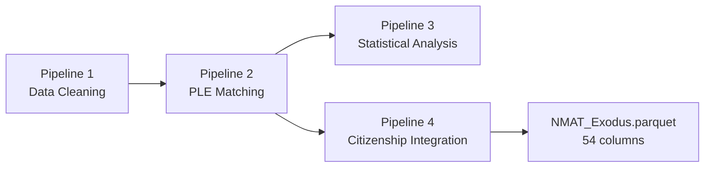

# NMAT_Exodus Data Dictionary

## Source
- **File:** `dataset/NMAT_Exodus.parquet`
- **Rows:** 178,927
- **Columns:** 54
- **Size:** 10.5 MB
- **Pipeline:** Output of Pipeline 4 (`4_Citizenship_Integration.py`), aggregating all 4 pipelines

## How This Dataset Is Produced



This dataset is the final, slimmed-down analytic file. It was reduced from 118 columns to 54 by removing columns unused by both the Streamlit dashboard (`dashboard.py`) and the `data_aggregator/` analysis scripts. A full backup of the original 118-column output is at `dataset/NMAT_Exodus.parquet.bak`.

## Scoring Framework

The NMAT has two parts, each with four subtests, producing standard scores (mean ≈ 500, SD ≈ 100) and raw scores (number of correct items).

| Part | Focus | Subtests | Standard Score Columns | Raw Score Columns |
|------|-------|----------|----------------------|-------------------|
| **Part I** | Aptitude / Cognitive Skills | Verbal, Inductive Reasoning, Quantitative, Perceptual Acuity | `NMS_VCss`, `NMS_IRss`, `NMS_Qss`, `NMS_PAss` | `Raw_Verbal`, `Raw_InductiveReasoning`, `Raw_Quantitative`, `Raw_PerceptualAcuity` |
| **Part II** | Science / Subject Knowledge | Biology, Physics, Social Science, Chemistry | `NMS_BIOss`, `NMS_PHYss`, `NMS_SSCss`, `NMS_CHEMss` | `Raw_Biology`, `Raw_Physics`, `Raw_SocialScience`, `Raw_Chemistry` |

**TRUE Raw Score = Part I Raw + Part II Raw** (recalculated from first principles — see `StoredVsDerivedMismatch`)

## Column Dictionary

### Core Identifiers

| Column | Type | Missing | Description | Pipeline Context |
|--------|------|-------:|-------------|-----------------|
| `APPNO_CLEAN` | string | 0% | Standardized application number used as the primary join key across all pipelines. Digits-only extract of the original NMAT application number. Formats vary: 6-digit (legacy, 0.4%), 7-digit (standard, 13.4%), 10-digit (newer, 85.3%). | Created in Pipeline 1 as the cleaned join key. Used by Pipeline 2 to match PLE records and by Pipeline 4 to merge citizenship data. |
| `PERSON_KEY` | string | 0% | Person-level deduplication key constructed from normalized name + birthdate. Used to identify repeat NMAT takers (25% of examinees took NMAT 2+ times, max 9 attempts). | Created in Pipeline 1. Drives `IS_BEST_NMAT_RECORD` selection and repeat-taker analysis in Pipeline 3. |
| `SEX` | string | ~0.03% | Standardized sex label ("Male" / "Female"). Derived from `NMA_Sex` (numeric code) or `NMASex` in earlier pipeline stages. | Passed through from raw NMAT data via Pipeline 1. Used for gender-based analysis in Pipeline 3 Section 11. |

### Time / Year

| Column | Type | Missing | Description | Pipeline Context |
|--------|------|-------:|-------------|-----------------|
| `Year` | int | 0% | NMAT examination year (2006–2018). All 13 years are represented. | Core grouping variable used across ALL pipelines. Defines the **observable cohort** (Year <= 2014) in Pipelines 2–3 to avoid right-censoring bias in PLE outcomes. |

### Education & Institution

| Column | Type | Missing | Description | Pipeline Context |
|--------|------|-------:|-------------|-----------------|
| `NMA_College` | string | 0% | Original college/university name as reported by the examinee. 3,251 unique values. Preserved for audit trail against the normalized `UNIVERSITY` field. | Raw input from NMAT. Used in Pipeline 1's university normalization (4-tier matching against UNIVS.csv). |
| `UNIVERSITY` | string | 0% | **Standardized** university name from UNIVS.csv lookup. 2,907 unique values. Falls back to the original `NMA_College` if no match was found (1,386 unmatched, 31.7%). | Output of Pipeline 1 university normalization. The authoritative institution identifier for all downstream analysis. |
| `UNI_TYPE` | string | 0% | University type classification: **Public** (18.9%), **Private** (79.1%), **Foreign** (1.7%), **Not Specified** (0.3%). Derived from UNIVS.csv with fallback to `School Type_rec2_FINAL`. | Used extensively in Pipeline 3 for group comparisons (Kruskal-Wallis, Chi-square). Required by the CHED amendment to distinguish SUCs from PHEIs. |
| `UNI_LOCATION` | string | 0% | University location class: **Local** (Philippine HEIs), **International** (foreign schools), **Unknown**. Derived from UNI_TYPE: Foreign → International, Public/Private → Local. | Used in Pipeline 3's extended institution analysis (Section 4A-Ext) for cross-tabulation with UNI_TYPE. |
| `CourseGroup` | string | 0% | Final grouped pre-med background used in all analyses. 6 categories derived via keyword matching on course name: **Medical & Allied**, **Natural Sciences**, **Social & Behavioral Sciences**, **Education**, **Engineering & Technology**, **Other**. | Created in Pipeline 1. One of the most-used grouping variables in Pipeline 3 (Kruskal-Wallis, Chi-square, Sankey flows, survival analysis). |

### Assessment Scores — NMAT Standard Scores

These are the **NMAT-reported standard scores** (mean ≈ 500, SD ≈ 100). They come directly from CEM and are used for subtest profile analysis.

| Column | Description | Pipeline Context |
|--------|-------------|-----------------|
| `NMS_VCss` | NMAT standard score: **Verbal** subtest (Part I) | Used in Pipeline 3 Section 8 (Subtest Profile Analysis) for heatmaps and radar charts by UNI_TYPE and CourseGroup. |
| `NMS_IRss` | NMAT standard score: **Inductive Reasoning** subtest (Part I) | Same as above. |
| `NMS_Qss` | NMAT standard score: **Quantitative** subtest (Part I) | Same as above. |
| `NMS_PAss` | NMAT standard score: **Perceptual Acuity** subtest (Part I) | Same as above. |
| `NMS_BIOss` | NMAT standard score: **Biology** subtest (Part II) | Same as above. |
| `NMS_PHYss` | NMAT standard score: **Physics** subtest (Part II) | Same as above. |
| `NMS_SSCss` | NMAT standard score: **Social Science** subtest (Part II) | Same as above. |
| `NMS_CHEMss` | NMAT standard score: **Chemistry** subtest (Part II) | Same as above. |

### Assessment Scores — Composites

| Column | Type | Missing | Description | Pipeline Context |
|--------|------|-------:|-------------|-----------------|
| `NMS_APT` | float | 0% | **Part I (Aptitude) composite** standard score. Aggregates Verbal + Inductive Reasoning + Quantitative + Perceptual Acuity. | Used in Pipeline 3 for yearly summary statistics, Mann-Whitney U tests, and composite performance comparisons. |
| `NMS_SA` | float | 0% | **Part II (Science) composite** standard score. Aggregates Biology + Physics + Social Science + Chemistry. | Same as above. |
| `NMS_GPS` | float | 0% | **General Performance Score** — the overall standardized NMAT score. The primary metric for overall performance comparisons. | The most-used score metric in Pipeline 3: Kruskal-Wallis stability tests, Mann-Whitney PLE comparisons, yearly summary tables. |
| `NMS_PER_num` | float | 0.7% | **Percentile rank** (0–100). The examinee's percentile standing among all test-takers. Derived by coercing the raw `NMS_PER` field to numeric. | The single most-used column in the dataset. Used in: bin assignment, group comparisons, trend analysis, box plots, statistical tests, and all CHED-relevant cut-off analysis. |
| `PercentileBin` | string | ~0.7% | **Percentile bin** (B1–B10). Decile categorization of `NMS_PER_num` using **left-closed intervals** `[0,10), [10,20), ..., [90,100]`. | Created by `pd.cut()` in the dashboard at load time (or renamed from `PercentileDecile` in older pipeline versions). **B4+** = at or above 30th percentile; **B5+** = at or above 40th percentile (CHED cut-off-relevant). |

### Assessment Scores — TRUE Raw Scores

**These are the AUTHORITATIVE raw scores.** The pipeline recalculated them from first principles because 42.2% of the stored totals in the CEM data were incorrect. The TRUE sum uses all 8 component raw scores and is calculated only when ALL 8 are present.

| Column | Type | Missing | Description | Pipeline Context |
|--------|------|-------:|-------------|-----------------|
| `TotalRawScoreTRUE` | float | ~0.03% | **TRUE total raw score** = sum of all 8 raw components (Verbal + IR + Quantitative + Perceptual Acuity + Biology + Physics + Social Science + Chemistry). Only calculated when all 8 are non-null. | The authoritative total score for all analyses in Pipeline 3. Replaces `StoredRawTotal` which was wrong in 42.2% of records. |
| `PartIRawScoreTRUE` | float | ~0.03% | **TRUE Part I raw score** = sum of Verbal + IR + Quantitative + Perceptual Acuity. | Used for Part I trend analysis, Part I vs Part II comparisons, and Mann-Whitney tests. |
| `PartIIRawScoreTRUE` | float | ~0.03% | **TRUE Part II raw score** = sum of Biology + Physics + Social Science + Chemistry. | Same as above. |

### Assessment Scores — Raw Components

These are the individual item-correct scores per subtest. Used for the most granular score analysis.

| Column | Description |
|--------|-------------|
| `Raw_Verbal` | Raw subscore: Verbal (Part I) |
| `Raw_InductiveReasoning` | Raw subscore: Inductive Reasoning (Part I) |
| `Raw_Quantitative` | Raw subscore: Quantitative (Part I) |
| `Raw_PerceptualAcuity` | Raw subscore: Perceptual Acuity (Part I) |
| `Raw_Biology` | Raw subscore: Biology (Part II) |
| `Raw_Physics` | Raw subscore: Physics (Part II) |
| `Raw_SocialScience` | Raw subscore: Social Science (Part II) |
| `Raw_Chemistry` | Raw subscore: Chemistry (Part II) |

### Assessment Scores — CEM Matched Scores

These columns come from the CEM data matched to each NMAT record. They include the original standard scores and composites from CEM (slightly different computation than the NMAT-reported scores above, preserved for auditing).

| Column | Type | Missing | Description |
|--------|------|-------:|-------------|
| `APT_CEM` | float | ~0.03% | CEM-calculated Aptitude composite score (Part I). |
| `SA_CEM` | float | ~0.03% | CEM-calculated Science composite score (Part II). |
| `GPS_CEM` | float | ~0.03% | CEM-calculated General Performance Score. |
| `Percentile_CEM` | float | ~2.3% | CEM-calculated percentile rank. |
| `AllRawComponentsPresent` | bool | ~0.03% | True when all 8 raw component scores are available for TRUE recalculation. |
| `HasTRUErawScores` | bool | 0% | True when the record has valid TRUE raw scores (used as a filter flag). |

### Validation & Stored Scores

These columns track the score recalibration audit. **Key finding:** `StoredRawTotal` was incorrect in 42.2% of records (107,422 mismatches vs `TotalRawScoreTRUE`). The calculated total (`CalculatedRawTotal_Source`) was always correct (0 mismatches).

| Column | Type | Missing | Description |
|--------|------|-------:|:------------|
| `StoredRawTotal` | float | ~44% | The original stored raw score total from CEM (`STU_RSCORE`). Only present when the CEM record had a stored total. **WARNING:** Wrong in 42.2% of records. |
| `CalculatedRawTotal_Source` | float | ~0.03% | The CEM-calculated raw total (`STU_RSCORE_CALC`). **Always matches TotalRawScoreTRUE.** |
| `StoredVsDerivedMismatch` | float | ~44% | 1.0 when `StoredRawTotal` differs from `TotalRawScoreTRUE`, 0.0 when they match. NaN when `StoredRawTotal` is missing. **107,422 mismatches found.** |
| `CalcVsDerivedMismatch` | float | ~0.03% | 1.0 when `CalculatedRawTotal_Source` differs from `TotalRawScoreTRUE`, otherwise 0.0. **Always 0 — no mismatches.** |
| `HasCEMMatch` | bool | 0% | True when the NMAT record has a matched CEM row (178,882 of 178,927 have CEM data). |

### PLE Linkage Flags

These flags identify whether an NMAT examinee was matched to a Philippine Licensure Examination (PLE) passer record. Matching is **purely deterministic** (no fuzzy matching) after the DE-FUZZY refactor.

| Column | Type | Missing | Description | Pipeline Context |
|--------|------|-------:|-------------|-----------------|
| `IS_PLE_PASSER` | bool | 0% | True if the examinee matched a PLE record (any match status). Covers all attempts by confirmed PLE passers. | 49,986 rows marked True. Includes multiple NMAT attempts for the same person. |
| `IS_PLE_ANALYSIS_SAFE` | bool | 0% | **Strict PLE linkage flag.** True only when the match is `FINAL_MATCH`, `MANUAL_APPNO_MATCH`, or `DETERMINISTIC_APPNO` — the three clean deterministic statuses. | 49,986 rows marked True. This is the authoritative flag for all PLE-linked analyses. **Always use this for PLE comparisons — NOT `IS_PLE_PASSER`.** |
| `IS_BEST_NMAT_RECORD` | bool | 0% | **Best-record flag** — exactly one row per person (identified by `PERSON_KEY`). For PLE passers: the specific NMAT attempt that matched to the PLE record. For others: highest percentile, latest year tiebreak. | **CRITICAL:** Use this for person-level analyses to avoid repeat-taker inflation (25% of examinees took NMAT 2+ times). Pipeline 3 uses this as the default filter. |
| `PLE_MATCH_METHOD` | string | ~68% | Method used for the PLE match: `EXACT`, `MANUAL_APPNO_MATCH`, `DETERMINISTIC_APPNO`, or NaN for unmatched records. | From Pipeline 2's 3-stage deterministic matching. |
| `PLE_YEAR_PASSED` | float | ~69% | Year of PLE passage for matched records (2011–2022). NaN for unmatched. | Used to compute `PLE_YEAR_GAP` and for PLE year trend analysis. |
| `PLE_YEAR_GAP` | float | ~72% | `PLE_YEAR_PASSED` minus `Year` (NMAT year). Represents years between NMAT and PLE passage. Median gap varies by decile. | Used in Pipeline 3 Section 10 (gap analysis) and in the disambiguator's year-gap filter (>= 5 years). |
| `PLE_MATCH_CONFIDENCE` | float | ~68% | Numeric confidence score for the PLE match (100 = exact, etc.). NaN for unmatched. | Audit field from Pipeline 2. |

### Citizenship (Pipeline 4)

These columns are produced by **Pipeline 4: Citizenship Integration** — the final enrichment step. They implement a **3-tier hierarchy of truth**:

1. **Tier 1 (Ground Truth):** `REAL_FOREIGNERS.csv` — 32,501 records with verified nationalities
2. **Tier 2 (Inferred):** `pseudo_citizenship_profiling_FINAL.csv` — 317 name-based FOREIGN inferences
3. **Tier 3 (Default):** Filipino — everyone else

| Column | Type | Missing | Description | Values |
|--------|------|-------:|-------------|--------|
| `CITIZENSHIP_FINAL` | string | **0%** | The **definitive citizenship label** after applying the 3-tier hierarchy. Nationalities are canonicalized (e.g., both "India" and "Indian" → "India"). 108 unique values. | **Filipino** (146,413), **India** (26,490), **Nepal** (1,158), **Thailand** (1,062), **United States** (839), **Nigeria** (639), and 102 others |
| `FOREIGNER_STATUS` | string | **0%** | High-level foreigner classification flag. | **Filipino** (146,413), **Verified Foreigner** (32,501 — from REAL_FOREIGNERS.csv ground truth), **Likely Foreigner** (13 — from pseudo-citizenship inference only) |
| `name_based_assessment` | string | ~99.5% | Free-text assessment from the pseudo-citizenship profiling file. Only populated for the 871 records in the profiling CSV. Used for record-level display in dashboards. | "Likely true foreigner", "Likely Filipino / Filipino-origin", etc. |

### Data Integrity Flags

| Column | Type | Missing | Description |
|--------|------|-------:|-------------|
| `StoredVsDerivedMismatch` | float | ~44% | 1.0 when stored total ≠ TRUE total; 0.0 when they match. NaN when stored total missing. |
| `CalcVsDerivedMismatch` | float | ~0.03% | 1.0 when calculated total ≠ TRUE total; 0.0 when they match. Always 0. |

---

## Interpretation Guide

### Person-Level Analysis
```python
# Use the best-record flag to get one row per person
df_person = df[df["IS_BEST_NMAT_RECORD"] == True]
```

### Observable Cohort (PLE-linked Analysis)
```python
# Restrict to examinees who've had time to take the boards
df_observable = df[df["Year"] <= 2014]
```

### CHED Cut-Off Analysis (30th vs 40th Percentile)
```python
# B4 = 30th-40th percentile (30th cut-off means "at or above B4")
# B5 = 40th-50th percentile (40th cut-off means "at or above B5")
above_30th = df["PercentileBin"].isin(["B4","B5","B6","B7","B8","B9","B10"])
above_40th = df["PercentileBin"].isin(["B5","B6","B7","B8","B9","B10"])
```

### Foreign Student Analysis
```python
# Verified foreigners from ground-truth data
foreign = df[df["FOREIGNER_STATUS"] == "Verified Foreigner"]
# Likely foreigners from name-based inference
likely_foreign = df[df["FOREIGNER_STATUS"] == "Likely Foreigner"]
```

### PLE Performance Comparison
```python
ple_passers = df[df["IS_PLE_ANALYSIS_SAFE"] == True]
non_passers = df[df["IS_PLE_ANALYSIS_SAFE"] != True]
```

---

## Pipeline Outputs Referenced

| Stage | Output | Description |
|-------|--------|-------------|
| **P1** | `NMAT_FINAL.parquet` (101 cols) | After cleaning, score recalibration, university normalization |
| **P2** | `NMAT_Ultima.parquet` (115 cols) | After PLE matching — superseded by Exodus |
| **P2** | `PLE_MATCH_MASTER.csv` (43,601 rows) | One canonical match record per PLE passer |
| **P2** | `PLE_PASSERS_IN_NMAT.csv` (36,305 rows) | Best-record PLE passers only |
| **P3** | `analysis_output/` (95 files) | Pipeline 3 analysis outputs |
| **P4** | **`NMAT_Exodus.parquet`** (54 cols) | **Final output — this file** |
| **P4** | `NMAT_Exodus.parquet.bak` (118 cols) | Full column backup |

---

## Version History

| Date | Change | Details |
|------|--------|---------|
| 2026-07-27 | Initial 54-col lite version | Columns reduced from 118 to 54 after usage audit. 64 unused columns removed. Size reduced 62.4% (27.9 MB → 10.5 MB). |
| 2026-07-27 | `PercentileBin` replaces `PercentileDecile` | Bin labels changed from D1-D10 to B1-B10 (left-closed intervals). Renamed during BIN_REFACTOR. |
| 2026-07-27 | `CITIZENSHIP_FINAL`, `FOREIGNER_STATUS` added | Pipeline 4 citizenship integration. 3-tier hierarchy. |
| 2026-07-07 | DE-FUZZY refactor | All fuzzy matching removed from Pipeline 2. Deterministic-only PLE matching. |
| 2026-06-23 | `TotalRawScoreTRUE` recalculation | TRUE scores computed from 8 components. Stored totals found wrong in 42.2% of records. |

---

*Comprehensive data dictionary for `dataset/NMAT_Exodus.parquet` (54 columns, 178,927 rows). Contextual descriptions reference the 4-pipeline architecture. See `pipeline_architecture.md` for full pipeline documentation.*
