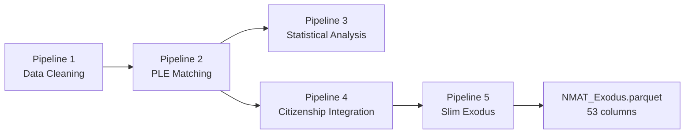

# NMAT_Exodus Data Dictionary

## Source

- **File:** `dataset/NMAT_Exodus.parquet`
- **Rows:** 178,927 (exam sittings, not unique people)
- **Columns:** 53
- **md5:** `28b85ac53af13b4a2ef3ee93527c97c1`
- **Three byte-identical copies**, enforced by `5_Slim_Exodus.py`:
  `dataset/NMAT_Exodus.parquet`, `streamlit_dashboard/main_dashboard/NMAT_Exodus.parquet`,
  `streamlit_dashboard/CHED_relevant_dashboard/NMAT_Exodus.parquet`. A copy that drifts from the
  canonical md5 is a bug — check `dataset/EXODUS_MANIFEST.json`.
- **Pipeline:** Output of Pipeline 5 (`5_Slim_Exodus.py`), which slims Pipeline 4's
  118-column `NMAT_Exodus.parquet.bak` down to the 53 columns actually consumed by the
  dashboards and `data_aggregator/`.

Every number in this document was read directly off the live parquet on 2026-08-14 (see the
commands inline); it is not transcribed from an earlier design doc.

## How This Dataset Is Produced



Pipeline 3 branches off Pipeline 2's output for its own analysis-only artifacts and does not feed
the shipped Exodus file. See `pipeline_architecture.md` for the full chain, including the two
root-cause defects (RC-0, O-24) fixed upstream of this file.

## Scoring Framework

The NMAT has two parts, each with four subtests, producing standard scores (mean ~500, SD ~100)
and raw scores (number of correct items).

| Part | Focus | Subtests | Standard Score Columns | Raw Score Columns |
|------|-------|----------|----------------------|-------------------|
| **Part I** | Aptitude / Cognitive Skills | Verbal, Inductive Reasoning, Quantitative, Perceptual Acuity | `NMS_VCss`, `NMS_IRss`, `NMS_Qss`, `NMS_PAss` | `Raw_Verbal`, `Raw_InductiveReasoning`, `Raw_Quantitative`, `Raw_PerceptualAcuity` |
| **Part II** | Science / Subject Knowledge | Biology, Physics, Social Science, Chemistry | `NMS_BIOss`, `NMS_PHYss`, `NMS_SSCss`, `NMS_CHEMss` | `Raw_Biology`, `Raw_Physics`, `Raw_SocialScience`, `Raw_Chemistry` |

**TRUE Raw Score = Part I Raw + Part II Raw**, recalculated from the 8 components. This
arithmetic is exact: `max(abs(sum(Raw_8) - TotalRawScoreTRUE)) < 1e-6` across all 178,882
non-null rows, verified as a structural (hard-fail) invariant in `5_Slim_Exodus.py` and in
`tests/test_data_invariants.py`.

## Critical framing before reading the columns

- **No medical-school identifier exists anywhere in this dataset.** `UNDERGRAD_UNIVERSITY` /
  `UNDERGRAD_UNI_TYPE` / `UNDERGRAD_UNI_LOCATION` / `UNDERGRAD_COURSE_GROUP` describe the
  applicant's **pre-med undergraduate degree**, not the medical school that trained them (proof:
  UP Diliman has no College of Medicine, yet 4,421 NMAT rows list it as `UNDERGRAD_UNIVERSITY`,
  1,914 of them confirmed PLE passers). No institution-level PLE passing-rate claim is
  supportable from this data, and `UNDERGRAD_UNI_TYPE` is not an SUC/PHEI proxy for CMO purposes.
- **`IS_PLE_PASSER` flags 49,086 SITTINGS, not 49,086 people.** Those sittings belong to **37,420
  distinct `PERSON_KEY`s** (out of 43,630 unique names in the PLE source, an 85.8% match). The flag
  is a person-level attribute propagated across a person's sittings. Cite 49,086 as a sitting count
  and 37,420 as the passer count; person-level rates such as the 45.44% observable linkage are
  computed on best-record rows and are unaffected.
- **`IS_PLE_PASSER` is the only authoritative passer flag.** `PLE_YEAR_PASSED`,
  `PLE_MATCH_METHOD`, `PLE_MATCH_CONFIDENCE`, `PLE_YEAR_GAP` are diagnostic metadata — their
  non-null sets do **not** nest inside `IS_PLE_PASSER`. Never use them as a passer denominator.
- **"Not linked" is never "failed."** The PLE source file contains passers only. Every rate built
  from `IS_PLE_PASSER` is a **linkage rate**, never a pass rate.
- **`B1` is the LOWEST percentile decile, `B10` the highest.** A plain string sort places `B10`
  between `B1` and `B2` — always order bins explicitly as `B1..B10`.
- **`PERSON_KEY` is a weak identity key.** It is built from normalized name + a coarse birthdate
  fragment (14.09% of rows have an empty birthdate component, so the key degrades to name-only).
  6,148 keys carry contradictory `SEX` across their rows — direct proof of name collisions, not
  genuine repeat attempts. See `PERSON_KEY_AMBIGUOUS` below and treat every person-level count as
  carrying this uncertainty.
- **Use `IS_BEST_OBSERVABLE_RECORD` for the observable/PLE-linked cohort, never
  `IS_BEST_NMAT_RECORD & (Year <= 2014)`.** The naive combination silently drops 3,721 people
  whose overall-best attempt falls after 2014 (65,782 vs the correct 69,503) — see the
  `IS_BEST_OBSERVABLE_RECORD` entry.

## Column Dictionary

Columns are listed in the exact order they appear in the parquet (`df.columns`, index 0-52).

### Core Identifiers (0-3)

| # | Column | Type | Nulls | Distinct | Description |
|---|--------|------|------:|---------:|-------------|
| 0 | `APPNO_CLEAN` | string | 0 | 178,926 | Digits-only application number, the primary join key across all pipelines. Length distribution: 10-digit (85.3%, 152,540), 7-digit (13.4%, 23,985), 6-digit (1.3%, 2,402). **One collision**: appno `1073584` (`PERSON_KEY` "VENTANILLA, GLEN TAN\|\|", Year 2007) appears on two rows carrying **different score sets** (percentiles 98 and 80, same test date and centre) — a source-data collision, not a duplicated row. It is why a row-count-based repeat-taker tally (33,714) differs by one from the distinct-appno tally (33,713). |
| 1 | `PERSON_KEY` | string | 0 | 134,869 | Person-deduplication key = normalized name + `"\|\|"` + birthdate fragment. Drives `IS_BEST_NMAT_RECORD`. **Weak** — see the framing note above; 6,148 keys are flagged ambiguous by `PERSON_KEY_AMBIGUOUS`. |
| 2 | `Year` | int64 | 0 | 13 | NMAT examination year, 2006-2018 inclusive. Defines the observable cohort (`Year <= 2014`, `IS_OBSERVABLE_COHORT`). |
| 3 | `SEX` | string | 45 | 2 | `Female` (101,240) / `Male` (77,642) / null (45, 0.03%). |

### Undergraduate Institution (4-7)

Renamed from `UNIVERSITY`/`UNI_TYPE`/`UNI_LOCATION`/`CourseGroup` specifically to make clear
these describe the applicant's **pre-med bachelor's degree**, not any medical school (see the
framing note above — this is the single most important caveat in this file).

| # | Column | Type | Nulls | Distinct | Description |
|---|--------|------|------:|---------:|-------------|
| 4 | `UNDERGRAD_UNIVERSITY` | string | 0 | 2,907 | Standardized undergraduate institution name, matched against `UNIVS.csv` in Pipeline 1's 4-tier cascade. |
| 5 | `UNDERGRAD_UNI_LOCATION` | string | 0 | 3 | `Local` (174,780) / `International` (2,315) / `Unknown` (1,832). |
| 6 | `UNDERGRAD_UNI_TYPE` | string | 0 | 4 | `Private` (137,476, 76.8%) / `Public` (37,304, 20.8%) / `Foreign` (2,315, 1.3%) / `Not Specified` (1,832, 1.0%). |
| 7 | `UNDERGRAD_COURSE_GROUP` | string | 0 | 6 | Pre-med course grouping: `Medical & Allied` (86,140), `Natural Sciences` (55,900), `Social & Behavioral Sciences` (22,022), `Other` (9,855), `Education` (4,162), `Engineering & Technology` (848). |

### Percentile & Composite Scores (8-12)

| # | Column | Type | Nulls | Distinct | Description |
|---|--------|------|------:|---------:|-------------|
| 8 | `PercentileBin` | string | 4,141 (2.3%) | 10 | Decile bin `B1`-`B10` from `NMS_PER_num`, left-closed `[0,10) .. [90,100]`. **`B1` = weakest (0-9), `B10` = strongest (90-99)** — verified monotonic against mean `TotalRawScoreTRUE` per bin (B1 75.1 -> B10 175.5). Counts: B1 24,434, B2 19,393, B3 17,443, B4 18,600, B5 15,857, B6 15,829, B7 15,282, B8 15,407, B9 15,500, B10 17,041. |
| 9 | `NMS_PER_num` | float64 | 1,275 (0.7%) | 101 | Percentile rank (0-100), the outcome variable underlying every cut-off/bin analysis and `PercentileBin`. |
| 10 | `NMS_GPS` | int64 | 0 | 443 | General Performance Score — overall standard score. |
| 11 | `NMS_APT` | int64 | 0 | 320 | Part I (Aptitude) composite standard score. |
| 12 | `NMS_SA` | int64 | 0 | 334 | Part II (Science) composite standard score. |

### Subtest Standard Scores (13-20)

| # | Column | Subtest | Part |
|---|--------|---------|------|
| 13 | `NMS_VCss` | Verbal | I |
| 14 | `NMS_IRss` | Inductive Reasoning | I |
| 15 | `NMS_Qss` | Quantitative | I |
| 16 | `NMS_PAss` | Perceptual Acuity | I |
| 17 | `NMS_BIOss` | Biology | II |
| 18 | `NMS_PHYss` | Physics | II |
| 19 | `NMS_SSCss` | Social Science | II |
| 20 | `NMS_CHEMss` | Chemistry | II |

All int64, 0 nulls, 127-138 distinct values each.

### TRUE Raw Scores — authoritative (21-23)

| # | Column | Type | Nulls | Description |
|---|--------|------|------:|-------------|
| 21 | `TotalRawScoreTRUE` | float64 | 45 (0.03%) | **The authoritative total raw score** = sum of the 8 `Raw_*` components below. Recalculated from first principles because a large share of the stored CEM totals were wrong (see `StoredVsDerivedMismatch`). |
| 22 | `PartIRawScoreTRUE` | float64 | 45 | Sum of the 4 Part I raw components. |
| 23 | `PartIIRawScoreTRUE` | float64 | 45 | Sum of the 4 Part II raw components. |

### Raw Score Components (24-31)

All float64, 45 nulls each, 31 distinct values (item counts 0-30 per subtest).

| # | Column | Subtest |
|---|--------|---------|
| 24 | `Raw_Verbal` | Verbal (Part I) |
| 25 | `Raw_InductiveReasoning` | Inductive Reasoning (Part I) |
| 26 | `Raw_Quantitative` | Quantitative (Part I) |
| 27 | `Raw_PerceptualAcuity` | Perceptual Acuity (Part I) |
| 28 | `Raw_Biology` | Biology (Part II) |
| 29 | `Raw_Physics` | Physics (Part II) |
| 30 | `Raw_SocialScience` | Social Science (Part II) |
| 31 | `Raw_Chemistry` | Chemistry (Part II) |

### Stored-Score Validation (32-35)

| # | Column | Type | Nulls | Description |
|---|--------|------|------:|-------------|
| 32 | `StoredRawTotal` | float64 | 79,611 (44.5%) | CEM's original stored raw total (`STU_RSCORE`). Present only when the CEM record carried a stored total (99,316 of 178,927 rows). |
| 33 | `StoredVsDerivedMismatch` | **boolean** (nullable) | 79,611 | `True` when `StoredRawTotal != TotalRawScoreTRUE`, `False` when they agree, `NA` when no stored total exists. **56,065 of the 99,316 rows that carry a stored total disagree (56.45%)** — 31.33% of all 178,927 rows. Coerced from a string-typed column to pandas nullable `boolean` in Pipeline 5 (the old `str` dtype meant `bool("False") is True`, silently inverting every truthiness test). **The figure "42.2%" seen elsewhere is also correct — it is a different population.** Measured on `CEM_DATA.csv`: `STU_RSCORE != STU_RSCORE_CALC` on 107,422 of 254,308 rows = **42.24% of the whole CEM file**, against **56.45% of the 99,316 NMAT-matched rows carrying a stored total**. Neither figure is wrong; always name the denominator. Note also that CEM itself already flagged these: `STU_RSCORE_VALID` marks exactly those 107,422 rows `INVALID`, a perfect predictor with zero exceptions either way — so the recalculation reproduces a pre-existing CEM QA judgement rather than discovering an unknown defect. The errors are genuine arithmetic slips (median ±1, 88.6% within ±5), not a different scale. |
| 34 | `CalculatedRawTotal_Source` | float64 | 45 | CEM's own calculated raw total (`STU_RSCORE_CALC`). Identical to `TotalRawScoreTRUE` on every non-null row — confirms the recalculation logic, not just the stored total, was independently reproducible. |
| 35 | `HasTRUErawScores` | **boolean** | 0 | `True` for 178,882 rows (99.97%), `False` for 45 — whether all 8 raw components were present to compute `TotalRawScoreTRUE`. Coerced from `str` in Pipeline 5, same fix as `StoredVsDerivedMismatch`. |

### CEM-Matched Scores (36-39)

Independently-computed CEM-side scores, preserved for audit cross-checking against the
NMAT-reported `NMS_*` columns above.

| # | Column | Type | Nulls | Description |
|---|--------|------|------:|-------------|
| 36 | `APT_CEM` | float64 | 45 | CEM-side Part I composite. |
| 37 | `SA_CEM` | float64 | 45 | CEM-side Part II composite. |
| 38 | `GPS_CEM` | float64 | 45 | CEM-side overall composite. |
| 39 | `Percentile_CEM` | float64 | 4,182 (2.3%) | CEM-side percentile rank. |

### Best-Record Flags (40)

| # | Column | Type | Nulls | Description |
|---|--------|------|------:|-------------|
| 40 | `IS_BEST_NMAT_RECORD` | bool | 0 | Exactly one `True` row per `PERSON_KEY` (134,869 True total — verified as a structural invariant: `groupby(PERSON_KEY).sum().eq(1).all()`). **One uniform rule for every person**, passers and non-passers alike: highest `NMS_PER_num` -> latest `Year` -> lowest `APPNO_CLEAN`, deterministic total order. This replaces an earlier, defective version that used a different selection rule for PLE passers than for everyone else and silently dropped 1,311 people from every "unique people" count. Use for person-level analysis in general (not for the *observable* cohort — see `IS_BEST_OBSERVABLE_RECORD` below). |

### PLE Linkage (41-45)

Matching is **deterministic only** — no fuzzy/`rapidfuzz` matching anywhere in this stage.

| # | Column | Type | Nulls | Description |
|---|--------|------|------:|-------------|
| 41 | `IS_PLE_PASSER` | bool | 0 | **The only authoritative passer flag.** `True` for 49,086 rows. Set when a candidate PLE record was accepted through the 3-stage deterministic cascade and the disambiguator (see `pipeline_architecture.md`). |
| 42 | `PLE_MATCH_METHOD` | string | 121,623 (68.0%) | `EXACT` (54,437), `MANUAL_APPNO_MATCH` (2,775), `DETERMINISTIC_APPNO` (92). Diagnostic metadata — do not use as a passer denominator. |
| 43 | `PLE_MATCH_CONFIDENCE` | float64 | 121,623 | `100.0` (49,086 rows — matches `IS_PLE_PASSER` exactly) or `50.0` (8,218 rows — lower-confidence `EXACT` candidates that did **not** clear the disambiguator and are therefore `IS_PLE_PASSER == False`). |
| 44 | `PLE_YEAR_PASSED` | float64 | 124,398 (69.5%) | Year of PLE passage. **The source `PLE_DATA.csv` covers ONLY 2011-2022 — zero records outside that window.** With a median NMAT-to-PLE gap of 6 years, this censors every cohort differently: a 2014 examinee must pass within 8 years to appear at all, while a 2006 examinee loses anyone who passed before 2011. `Year <= 2014` therefore does **not** make the observable cohort comparable, and any pooled linkage rate is a mixture over unequal windows. At an equal 8-year horizon the observable linkage is 39.4%, not 45.44%. **Never cite a linkage figure without stating the exposure window** — see `.claude/audit/_PIPELINE_ACCURACY_AUDIT.md` §1. Applies to accepted and some rejected-but-metadata-retaining rows. Non-null count (54,528) exceeds `IS_PLE_PASSER` (49,086) — the two sets are **not nested**; 7,318 rows have a year but are not counted passers (rejected candidates that kept metadata), and 2,776 are passers with no year (all `MANUAL_APPNO_MATCH`, whose source file lacks a year column). |
| 45 | `PLE_YEAR_GAP` | float64 | 132,708 (74.2%) | `PLE_YEAR_PASSED - Year`, range 5-15. Used by the disambiguator's year-gap check (candidates must clear >= 5 years). |

### Citizenship (46-47)

Produced by Pipeline 4's 3-tier hierarchy: Tier 1 `REAL_FOREIGNERS.csv` ground truth (32,501
records) -> Tier 2 name-based pseudo-citizenship inference (13 records) -> Tier 3 default
Filipino (146,413 records).

| # | Column | Type | Nulls | Description |
|---|--------|------|------:|-------------|
| 46 | `CITIZENSHIP_FINAL` | string | 0 | Final canonicalized nationality label, 91 distinct values. Top values: Filipino (146,413), India (26,491), Nepal (1,158), Thailand (1,062), United States (839), Nigeria (639). **Contains a literal placeholder `"Foreign (unspecified)"` (156 rows)** — an unresolved bucket, not a country; exclude or explicitly label it in nationality charts. **Nationality shares must use the full `Verified Foreigner` denominator (32,501)**, never a top-N subtotal — India is 81.5% of verified foreigners, not a higher figure computed off a truncated top list. |
| 47 | `FOREIGNER_STATUS` | string | 0 | `Filipino` (146,413) / `Verified Foreigner` (32,501, from Tier-1 ground truth) / `Likely Foreigner` (13, from Tier-2 name inference only). |

### Observable Cohort & Identity Diagnostics (48-50)

Added in Pipeline 5 to replace a broken predecessor and to expose, rather than hide, a
pre-existing identity-resolution weakness.

| # | Column | Type | Nulls | Description |
|---|--------|------|------:|-------------|
| 48 | `IS_OBSERVABLE_COHORT` | bool | 0 | `True` iff `Year <= 2014` (88,144 rows) — examinees with enough elapsed time to plausibly have sat the PLE. Replaces the retired `IS_PLE_ANALYSIS_SAFE`, which was found to be a byte-for-byte duplicate of `IS_PLE_PASSER` (documented as "Year<=2014" but actually true for 9,116 rows in 2015-2018) — using it as a cohort filter made every "observable pass rate" 100% by construction. Verified non-tautological: `not (IS_OBSERVABLE_COHORT == IS_PLE_PASSER).all()`. |
| 49 | `PERSON_KEY_AMBIGUOUS` | bool | 0 | `True` where a `PERSON_KEY` has **contradictory `SEX`** across the rows sharing it — direct, detectable evidence of two different people colliding on the same key. **6,148 distinct keys** (constant within each key, verified). This is a *lower bound*: it only catches collisions where the two merged people differ in sex; scaling by the observed 56.6%/43.4% sex split implies a true collision rate roughly double the detected one. Differing `UNDERGRAD_UNIVERSITY` alone was considered and explicitly **excluded** from this flag — repeat takers legitimately record their institution differently across sittings, so using it would over-flag 22,002 additional keys for no real signal. |
| 50 | `IS_BEST_OBSERVABLE_RECORD` | bool | 0 | **The observable cohort, correctly defined** — one `True` row per person, selected by the same uniform rule as `IS_BEST_NMAT_RECORD` but applied *within* `Year <= 2014` only. **69,503 True.** This is deliberately a separate flag from `IS_BEST_NMAT_RECORD & (Year <= 2014)` (the "naive" combination), because the naive form picks each person's overall-best attempt first and then filters by year — silently dropping the 3,721 people whose overall-best attempt falls in 2015+ even though they also sat, and were observable, in an earlier year (65,782 people / 46.69% linkage under the naive form vs. 69,503 / 45.44% under this flag). **Use `IS_BEST_OBSERVABLE_RECORD` for every PLE-linked, person-level analysis.** |

### PLE Match Provenance (51-52)

Optional diagnostic columns carried through from Pipeline 2 so a dashboard can state *why* a
candidate match was or wasn't counted, instead of silently showing a smaller passer count.

| # | Column | Type | Nulls | Description |
|---|--------|------|------:|-------------|
| 51 | `PLE_MATCH_OUTCOME` | string | 0 | `no_match` (121,623) / `accepted` (49,086, == `IS_PLE_PASSER`) / `rejected_ambiguous_person` (8,216 — 2+ candidates survived every identity check, so no single match could be accepted) / `rejected` (2). |
| 52 | `PLE_YEAR_UNCERTAIN` | bool | 0 | `True` for 110 rows — an accepted passer (`IS_PLE_PASSER == True`) whose specific PLE *year* could not be disambiguated because their matched application number was independently claimed by 2+ distinct PLE name records after per-name deduplication (85 such application numbers). Passer status is certain; the year attached to it is not. |

## Interpretation Guide

### Person-level analysis (general)
```python
df_person = df[df["IS_BEST_NMAT_RECORD"]]        # one row per PERSON_KEY, 134,869 rows
```

### Observable / PLE-linked cohort — use this, not the naive combination
```python
df_observable = df[df["IS_BEST_OBSERVABLE_RECORD"]]   # 69,503 rows, correct
# NOT: df[df["IS_BEST_NMAT_RECORD"] & (df["Year"] <= 2014)]   # 65,782 rows, WRONG — drops 3,721 people
```

### Linkage rate (never call this a "pass rate")
```python
linkage_rate = df_observable["IS_PLE_PASSER"].mean()   # 45.44%
```

### Percentile bins — always order explicitly
```python
BIN_ORDER = [f"B{i}" for i in range(1, 11)]   # B1 = weakest ... B10 = strongest
df["PercentileBin"] = pd.Categorical(df["PercentileBin"], categories=BIN_ORDER, ordered=True)
```

### Foreigner analysis
```python
verified_foreign = df[df["FOREIGNER_STATUS"] == "Verified Foreigner"]   # 32,501, denominator for nationality shares
likely_foreign   = df[df["FOREIGNER_STATUS"] == "Likely Foreigner"]     # 13
```

### What NOT to do
```python
# WRONG: NMA_College / IS_PLE_ANALYSIS_SAFE / AllRawComponentsPresent / CalcVsDerivedMismatch /
# name_based_assessment / HasCEMMatch no longer exist -- see pipeline_architecture.md for why.

# WRONG: treating UNDERGRAD_UNIVERSITY as a medical-school identifier. There isn't one in this data.

# WRONG: computing an "observable cohort pass rate" as IS_PLE_PASSER / IS_OBSERVABLE_COHORT rows
# without also restricting to IS_BEST_OBSERVABLE_RECORD -- IS_OBSERVABLE_COHORT is a row-level
# flag (88,144 sittings); person-level rates need the best-record restriction too.
```

## Removed, renamed, and added columns (vs. the pre-remediation 54-column file)

**Removed (6):**

| Column | Why |
|---|---|
| `IS_PLE_ANALYSIS_SAFE` | Byte-identical duplicate of `IS_PLE_PASSER`. Replaced by `IS_OBSERVABLE_COHORT`. |
| `NMA_College` | Redundant free-text duplicate of the university column, differing only in punctuation/casing but with different cardinality (3,251 vs 2,907) — a grouping hazard. |
| `AllRawComponentsPresent` | Constant (one distinct value) — zero information. |
| `CalcVsDerivedMismatch` | Constant (one distinct value) — zero information. |
| `name_based_assessment` | Non-null for only 871/178,927 rows (0.5%), never consulted by the citizenship tier logic, and contradicts the final `CITIZENSHIP_FINAL` label in 23 of those 871 rows. |
| `HasCEMMatch` | Byte-identical to `HasTRUErawScores` (both True for the same 178,882 rows). Two columns encoding one condition is the exact defect class (RC-1) this remediation targets; `HasTRUErawScores` was kept as the clearer name. |

**Renamed (4)** — all four now carry an `UNDERGRAD_` prefix to make the undergraduate-not-medical-school scope structurally explicit:
`UNIVERSITY` -> `UNDERGRAD_UNIVERSITY`, `UNI_TYPE` -> `UNDERGRAD_UNI_TYPE`,
`UNI_LOCATION` -> `UNDERGRAD_UNI_LOCATION`, `CourseGroup` -> `UNDERGRAD_COURSE_GROUP`.
No compatibility alias was kept — a silent alias would defeat the purpose of the rename.

**Added (5):** `IS_OBSERVABLE_COHORT`, `PERSON_KEY_AMBIGUOUS`, `IS_BEST_OBSERVABLE_RECORD`,
`PLE_MATCH_OUTCOME`, `PLE_YEAR_UNCERTAIN` — all documented above.

**Dtype-corrected (2):** `HasTRUErawScores`, `StoredVsDerivedMismatch` — were stored as `str`
(`bool("False") is True`, silently inverting truthiness checks), now nullable pandas `boolean`.

Net: 54 - 6 + 5 = 53.

## Pipeline Outputs Referenced

| Stage | Output | Rows x Cols |
|-------|--------|------|
| P1 | `NMAT_FINAL.csv` | 178,927 x 101 (the file Pipeline 2 reads; a `NMAT_FINAL.parquet` twin had zero readers and was removed in dataset cleanup) |
| P2 | `NMAT_Ultima.parquet` | 178,927 x 119 |
| P2 | `PLE_MATCH_MASTER.csv` | one row per matched PLE record |
| P4 | `NMAT_Exodus.parquet.bak` | 178,927 x 118 — deliberately kept as the **only full-column audit trail** in the repo; do not delete |
| P5 | **`NMAT_Exodus.parquet`** | **178,927 x 53 — this file** |

A `dataset/NMAT_Exodus.csv` ("for manual inspection") used to exist alongside the parquet; it had
zero code readers and was removed in the same cleanup. Do not expect it on disk, and do not
regenerate it as a documentation target.

See `pipeline_architecture.md` for the full 5-pipeline chain, including the two most consequential
defects found during remediation (RC-0, the matcher's hard percentile floor; O-24, the dead DOB
check) and their measured effect on this file's `IS_PLE_PASSER` numbers.

---

*Data dictionary for `dataset/NMAT_Exodus.parquet` (53 columns, 178,927 rows), rewritten against
the live file on 2026-08-14 as part of the post-remediation documentation pass. Every count in
this document was verified by direct query against the parquet, not carried over from prior
documentation.*
