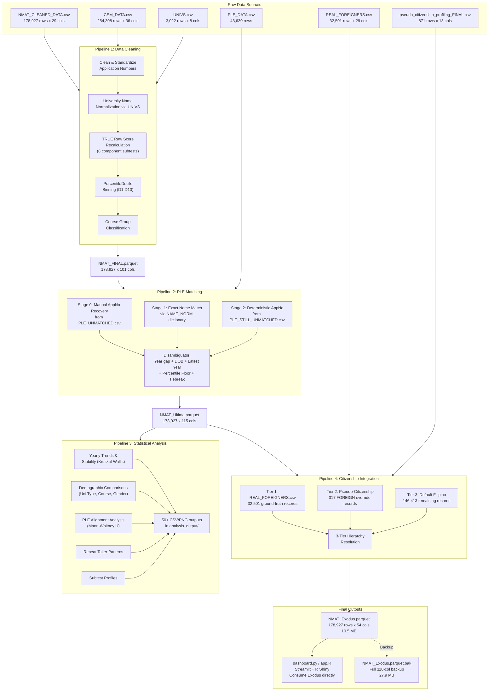
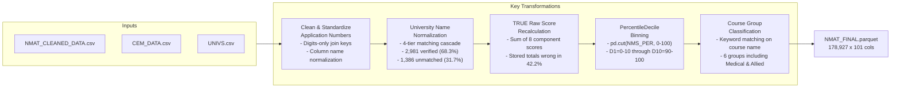
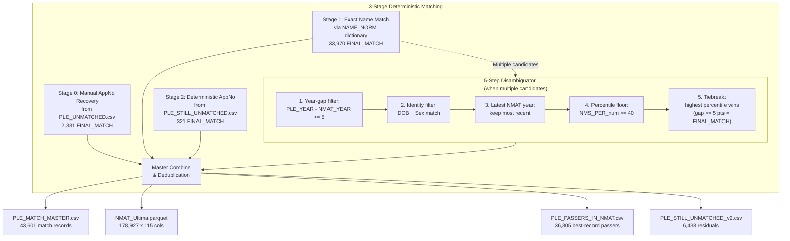
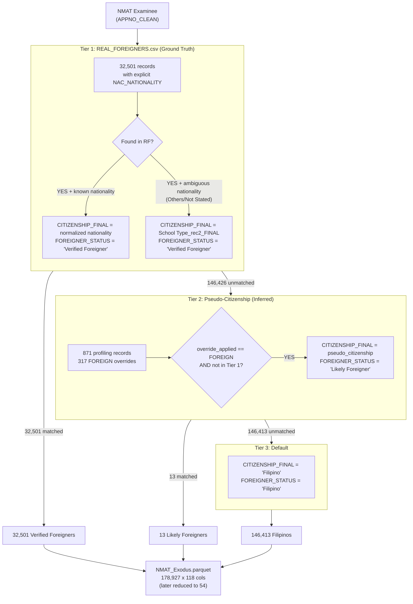
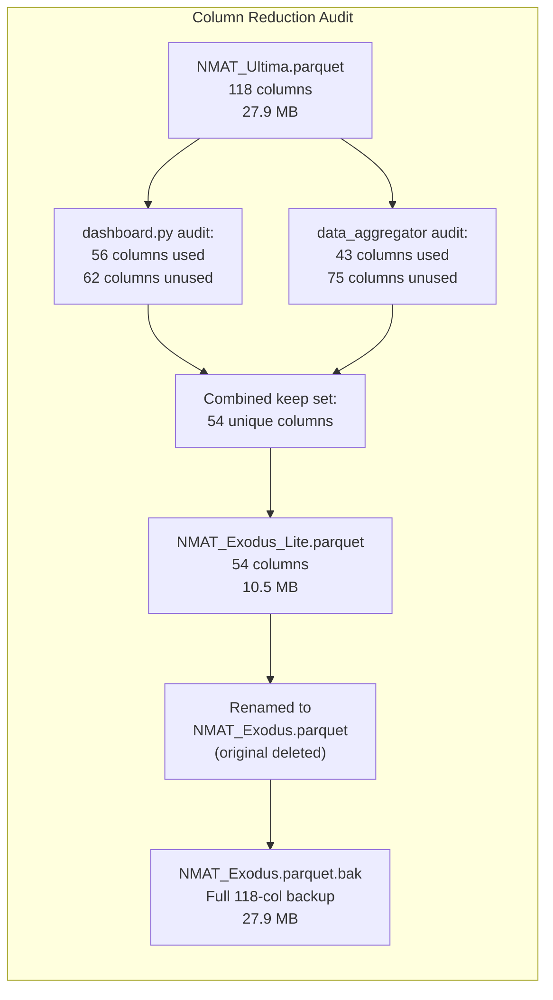

# NMAT Analysis — Pipeline Architecture

## End-to-End Data Transformation Documentation

**Last updated:** 2026-07-27  
**Final output:** `dataset/NMAT_Exodus.parquet` (54 columns, 10.5 MB)  
**Total examinees:** 178,927 rows covering NMAT 2006–2018

---

## Table of Contents

1. [System Overview](#1-system-overview)
2. [Pipeline 1: Data Cleaning & Score Recalibration](#2-pipeline-1-data-cleaning--score-recalibration)
3. [Pipeline 2: PLE Matching](#3-pipeline-2-ple-matching)
4. [Pipeline 3: Statistical Analysis](#4-pipeline-3-statistical-analysis)
5. [Pipeline 4: Citizenship Integration](#5-pipeline-4-citizenship-integration)
6. [Final Dataset: NMAT_Exodus.parquet](#6-final-dataset-nmat_exodusparquet)
7. [Key Decisions & Issues Faced](#7-key-decisions--issues-faced)

---

## 1. System Overview

**Total columns over time:**
| Stage | File | Columns | Size |
|-------|------|--------:|-----:|
| Raw NMAT input | NMAT_CLEANED_DATA.csv | 29 | ~50 MB |
| After Pipeline 1 | NMAT_FINAL.parquet | 101 | ~25 MB |
| After Pipeline 2 | NMAT_Ultima.parquet | 115 | ~28 MB |
| After Pipeline 4 | NMAT_Exodus.parquet | **54** | **10.5 MB** |

---

## 2. Pipeline 1: Data Cleaning & Score Recalibration

**File:** `1_Data_Cleaning_Pipeline.ipynb`  
**Status:** ✅ Working

### Inputs

| File | Rows | Description |
|------|-----:|-------------|
| `NMAT_CLEANED_DATA.csv` | 178,927 | Raw NMAT registration & score data |
| `CEM_DATA.csv` | 254,308 | Component-level score records from CEM (testing center) |
| `UNIVS.csv` | 3,022 | University reference table (canonical names, types, locations) |

### The Score Corruption Problem (42.2% mismatch)

The CEM data contained two raw score totals:
- **`STU_RSCORE`** (Stored Total): Wrong in **107,422 of 254,308 rows (42.2%)**
- **`STU_RSCORE_CALC`** (Calculated Total): **Always correct** (0 mismatches)

**Root cause:** The stored totals appear to come from a legacy computation or data entry error. The individual component scores (CA01–CA08) are reliable, so the pipeline recomputes `TotalRawScoreTRUE` by summing the 8 components anew. Both the wrong stored total and the TRUE derived total are preserved in the output for downstream auditing.

### University Normalization (4-Tier Matching Cascade)

UNIVS.csv is the **sole source of truth** for university classification — no APIs, no web search.

| Tier | Method | Matched | Cumulative |
|:----:|--------|--------:|:----------:|
| 1 | Exact primary key match (`NMA_College_norm`) | 2,674 | 61.2% |
| 2 | Exact secondary key match (`COLLEGE_UNIV_norm`) | 72 | 62.9% |
| 3 | Fuzzy match (rapidfuzz, score >= 88, gap >= 5) | 235 | 68.3% |
| 4 | Unmatched → retains original, "Not Specified" | 1,386 | 100.0% |

### Output

| File | Rows | Cols | Notes |
|------|-----:|-----:|-------|
| `NMAT_FINAL.csv` | 178,927 | 101 | Full merged dataset (CSV) |
| `output/NMAT_FINAL.parquet` | 178,927 | 101 | Parquet equivalent |
| `DsPy_verified.csv` | 4,367 | 20 | University verification dimension |
| `output/00_source_counts.csv` through `14_qa_*.csv` | ~15 files | — | Audit trail |

**Key new columns created:**
- `TotalRawScoreTRUE`, `PartIRawScoreTRUE`, `PartIIRawScoreTRUE`
- `PercentileDecile` (D1–D10)
- `CourseGroup` (6 categories)
- `UNIVERSITY`, `UNI_TYPE`, `UNI_LOCATION` (from UNIVS)
- `StoredVsDerivedMismatch`, `CalcVsDerivedMismatch`

---

## 3. Pipeline 2: PLE Matching

**File:** `2_PLE_Matching_Pipeline.ipynb`  
**Status:** ✅ Working (after DE-FUZZY refactor)

### Inputs

| File | Rows | Description |
|------|-----:|-------------|
| `NMAT_FINAL.csv` | 178,927 | Cleaned NMAT data from Pipeline 1 |
| `PLE_DATA.csv` | 43,630 | PLE passer records (2011–2022) |
| `PLE_UNMATCHED.csv` | 6,600 | PLE records without NMAT match |
| `PLE_STILL_UNMATCHED.csv` | 7,207 | Second-round residual unmatched |

### The DE-FUZZY Refactor

**Why fuzzy matching was removed:**

1. **False positives at common names.** Filipino surnames concentrate in narrow lexical bands; "DELA CRUZ, JUAN" could match dozens of candidates.
2. **Auditability.** Fuzzy outcomes were not reproducible across `rapidfuzz` versions and could not be traced to a source document.

**What changed:**
- `rapidfuzz` dependency removed entirely
- 3 fuzzy-matching cells deleted, replaced with deterministic AppNo matching
- Binary statuses only: `"Confirmed PLE passer"` / `"No confirmed PLE match"`
- `AMBIGUOUS` category abolished

### Match Results

| Status | Count | % of PLE records |
|--------|------:|:----------------:|
| **FINAL_MATCH** (accepted) | **36,395** | **83.4%** |
| AMBIGUOUS (manual review) | 772 | 1.8% |
| NO_VALID_MATCH (failed checks) | 2,298 | 5.3% |
| UNMATCHED_NO_APPNO | 4,135 | 9.5% |

### Observable Cohort

The **observable cohort** (`Year <= 2014`) ensures that PLE linkage analyses are fair:
- NMAT 2006 → 16-year window to observe PLE outcome
- NMAT 2014 → 8-year window (most have taken boards)
- NMAT 2015+ → insufficient observation window → right-censoring bias

**Cohort sizes:** 64,501 best-observable rows, 29,269 confirmed PLE passers.

---

## 4. Pipeline 3: Statistical Analysis

**File:** `3_NMAT_PLE_Analysis.ipynb`  
**Status:** ✅ Working

### Input

| File | Description |
|------|-------------|
| `NMAT_Ultima.parquet` | 178,927 rows × 115 columns |

### Key Statistical Tests

### Best-Record Filtering

`IS_BEST_NMAT_RECORD` selects exactly one row per person (identified by `PERSON_KEY`):
- For non-PLE persons: highest percentile, latest year
- For PLE passers: the **specific NMAT attempt that matched** to the PLE record

**Why:** 25.0% of examinees took NMAT 2+ times (max 9 attempts). Without deduplication, repeat takers violate independence assumptions of statistical tests.

### Output

| Metric | Count |
|--------|------:|
| CSV files | 59 |
| PNG charts | 36 |
| Total outputs | 95 |

All saved to `dataset/analysis_output/`.

---

## 5. Pipeline 4: Citizenship Integration

**File:** `4_Citizenship_Integration.py` (rewritten as `.py`, replaced original `.ipynb`)  
**Status:** ✅ Working (after rewrite fixing REAL_FOREIGNERS.csv omission)

### Inputs

| File | Rows | Description |
|------|-----:|-------------|
| `NMAT_Ultima.parquet` | 178,927 | Base dataset from Pipeline 2 |
| `REAL_FOREIGNERS.csv` | 32,501 | Ground-truth citizenship records |
| `pseudo_citizenship_profiling_FINAL.csv` | 871 | Name-based citizenship inference |

### The Problem with the Original Implementation

The original `4_Citizenship_Integration.ipynb` had a critical bug: it **never loaded `REAL_FOREIGNERS.csv`**. Despite the `CITIZENSHIP_REINTEGRATION_PLAN.md` explicitly specifying a 3-tier hierarchy with REAL_FOREIGNERS as Priority 1 ground truth, the code only used:
1. `NAC_NATIONALITY` from the main parquet (already present for all rows)
2. `pseudo_citizenship_profiling_FINAL.csv` (871 rows)

This meant ~32,500 verified foreign records were **completely ignored**.

### The 3-Tier Hierarchy (Fixed Implementation)

### Nationality Normalization

REAL_FOREIGNERS.csv contained **129 unique nationality values** (e.g., "India" vs "Indian", "Nepal" vs "Nepali"). A normalization map was created to canonicalize these to ~96 country names.

**Example normalizations:**
| Raw | Canonical |
|-----|-----------|
| India, Indian | India |
| Thailand, Thai | Thailand |
| United States, American | United States |
| Korea, Korean, R.O.C. | Korea (South) |
| Vietnemese (typo) | Vietnam |
| Camerdon (typo) | Cameroon |

### Multicultural Verification

Before building Pipeline 4, a **6-dimension cross-validation** was performed to confirm the join is safe:

| Dimension | Match Rate | Verdict |
|-----------|:----------:|:--------|
| AppNo key overlap | **100.0%** | ✅ |
| Name match | **100.0%** | ✅ |
| Year match | **100.0%** | ✅ |
| Percentile score | **100.0%** | ✅ |
| Nationality | **99.94%** | ✅ |
| College (format diff) | 89.4% | ✅ (format, not identity) |

### Output

| Column | Values | Description |
|--------|--------|-------------|
| `CITIZENSHIP_FINAL` | 108 unique | Final nationality label |
| `FOREIGNER_STATUS` | 3 values | "Verified Foreigner" (32,501) / "Likely Foreigner" (13) / "Filipino" (146,413) |
| `name_based_assessment` | String | Only populated for 871 pseudo-citizenship records |

---

## 6. Final Dataset: NMAT_Exodus.parquet

After all 4 pipelines, the original 118-column `NMAT_Ultima.parquet` was slimmed down to 54 columns by removing columns unused by both `dashboard.py` and `data_aggregator/`.

### 64 Columns Removed (Not Used by Any Consumer)

| Category | Columns Removed |
|----------|----------------|
| **CEM standard scores** | `Std_Verbal_CEM` through `Std_Chemistry_CEM` (8 cols) |
| **Verification pipeline** | `draft_university`, `draft_uni_type`, `draft_uni_location`, `draft_hint_method`, `draft_hint_score`, `verification_method`, `verification_status`, `confidence`, `evidence_summary`, `final_value_source`, `merge_verified_university`, `merge_cem` (12 cols) |
| **Medical school choices** | `MED_SCHOOL_CHOICE1`, `MED_SCHOOL_CHOICE2`, `MED_SCHOOL_CHOICE3` (3 cols) |
| **Personal info** | `NMA_Name`, `NMA_Sex`, `NMA_BirthDate`, `BDATE`, `AGE`, `CIVIL_STATUS`, `NAC_NATIONALITY`, `BDATE_CLEAN` (8 cols) |
| **Raw application fields** | `NMA_AppNo`, `NMA_AppNo_clean`, `NMA_TestDate`, `NMA_Graduating`, `NMA_YearGrad`, `NMA_Course`, `Course Classification`, `Course_recode` (8 cols) |
| **College raw fields** | `NMA_College_RAW`, `COLLEGE_NAME`, `COURSE_DESC`, `School Type_rec2_FINAL`, `NMC_Center`, `STU_TESTDATE`, `NMAT_YEAR`, `KEY` (8 cols) |
| **Location raw** | `NMAT Province local address`, `NMAT Region permanent address` (2 cols) |
| **Verification fields** | `UNIVERSITY_VERIFIED`, `UNI_TYPE_VERIFIED`, `UNI_LOCATION_VERIFIED` (3 cols) |
| **Raw score fields** | `NMS_PER`, `STU_RSCORE`, `STU_RSCORE_CALC`, `STU_RSCORE_VALID`, `STU_NO_clean`, `NAME_NORM`, `SOURCE_NMAT`, `raw_component_count` (8 cols) |
| **PLE extended** | `PLE_MATCH_STATUS`, `PLE_MATCH_REASON` (2 cols) |

### Verification After Slimming

- ✅ Row count preserved: 178,927
- ✅ All `REQUIRED_PIPELINE_COLS` present
- ✅ 0 nulls in `CITIZENSHIP_FINAL` and `FOREIGNER_STATUS`
- ✅ All 38 columns needed by `data_aggregator/` present
- ✅ `dashboard.py` syntax: PASSED
- ✅ Size reduction: **27.9 MB → 10.5 MB (62.4% smaller)**

---

## 7. Key Decisions & Issues Faced

### Decision 1: Deterministic Over Fuzzy Matching
**Problem:** Fuzzy name matching produced false positives and was not auditable.  
**Solution:** Eliminated all `rapidfuzz` matching from Pipeline 2. Replaced with 3-stage deterministic AppNo matching using curated AppNo lists.

### Decision 2: TRUE Raw Score Recalculation
**Problem:** 42.2% of stored raw score totals in CEM data were incorrect.  
**Solution:** Recalculated `TotalRawScoreTRUE` by summing 8 component scores from first principles. Preserved both stored and TRUE values for auditing.

### Decision 3: 4-Pipeline Separation
**Problem:** Modifying earlier pipelines could break downstream consumers.  
**Solution:** Added Pipeline 4 as a final enrichment step, keeping Pipelines 1-3 unchanged.

### Decision 4: REAL_FOREIGNERS.csv Integration
**Problem:** Original Pipeline 4 completely omitted the ground-truth citizenship data (32,501 records).  
**Solution:** Rewrote `4_Citizenship_Integration.py` to implement the proper 3-tier hierarchy with REAL_FOREIGNERS as Priority 1.

### Decision 5: Observable Cohort Restriction
**Problem:** Including recent NMAT cohorts in PLE analyses falsely depresses confirmed-PLE rates (right-censoring).  
**Solution:** All PLE-linked analyses use `Year <= 2014` (the "observable cohort"), giving examinees at least 8 years to take the boards.

### Decision 6: Best-Record Deduplication
**Problem:** 25% of examinees took NMAT multiple times, violating independence assumptions for statistical tests.  
**Solution:** `IS_BEST_NMAT_RECORD` flag selects exactly one record per person (for PLE passers: the matched attempt; for others: highest percentile).

### Decision 7: Column Slimming (Exodus Lite)
**Problem:** The dataset had 118 columns, but only 54 were used by any consumer.  
**Solution:** Audited both `dashboard.py` and `data_aggregator/`, removed 64 unused columns. Reduced file size by 62.4% (27.9 MB → 10.5 MB).

### Decision 8: Emoji Handling
**Problem:** A character-sanitization script replaced emojis in Streamlit tab labels with `?`.  
**Solution:** Previous commit (632b5bd) restored emoji icons by selectively recovering non-ASCII characters from git history. All 12 tab icons now display correctly.

---

## Record of Pipeline Output Files

| Stage | Output File | Location | Rows | Cols | Notes |
|-------|-------------|----------|-----:|-----:|-------|
| P1 | `NMAT_FINAL.parquet` | `dataset/output/` | 178,927 | 101 | Intermediate |
| P1 | `NMAT_FINAL.csv` | `dataset/` | 178,927 | 101 | Intermediate (CSV) |
| P2 | `NMAT_Ultima.parquet` | `dataset/` | 178,927 | **115** | Superseded by Exodus |
| P2 | `PLE_MATCH_MASTER.csv` | `dataset/output/` | 43,601 | — | One row per PLE passer |
| P2 | `PLE_PASSERS_IN_NMAT.csv` | `dataset/output/` | 36,305 | — | Best-record passers |
| P3 | Various CSV/PNG | `dataset/analysis_output/` | — | — | 95 files total |
| P4 | **`NMAT_Exodus.parquet`** | `dataset/` | 178,927 | **54** | **Final output (active)** |
| P4 | `NMAT_Exodus.parquet.bak` | `dataset/` | 178,927 | 118 | Full backup |
| P4 | `NMAT_Exodus.csv` | `dataset/` | 178,927 | 54 | CSV for inspection |

---

*Document generated from pipeline code, results documents, and wiki knowledge.*  
*All 4 pipelines verified working. Final dataset: `dataset/NMAT_Exodus.parquet` (54 cols, 10.5 MB).*
