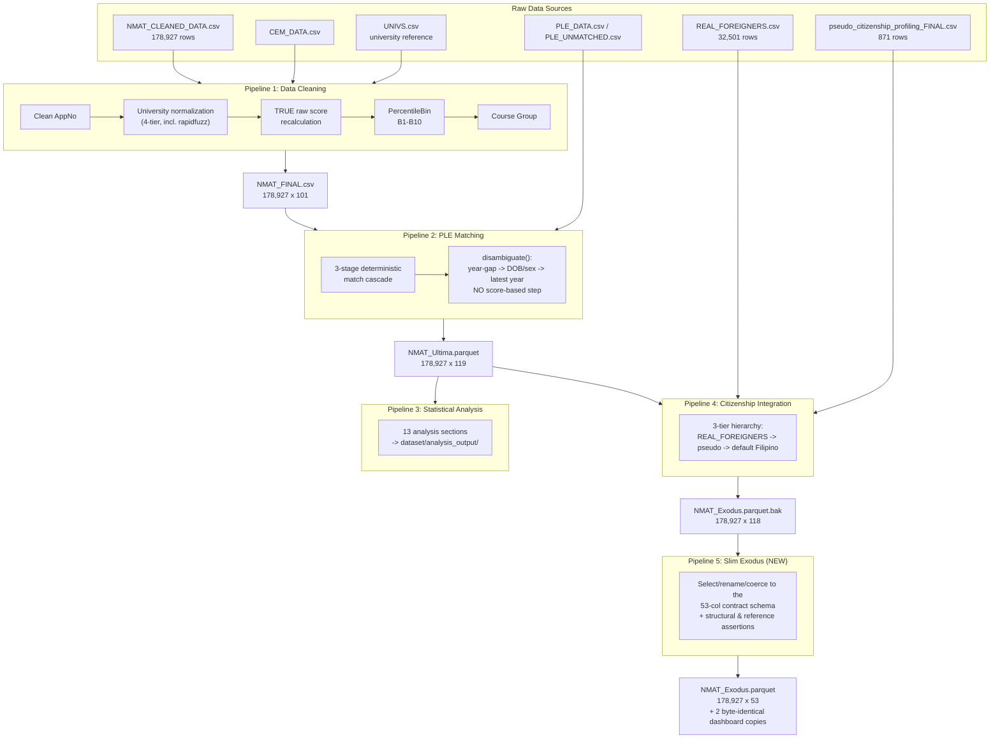
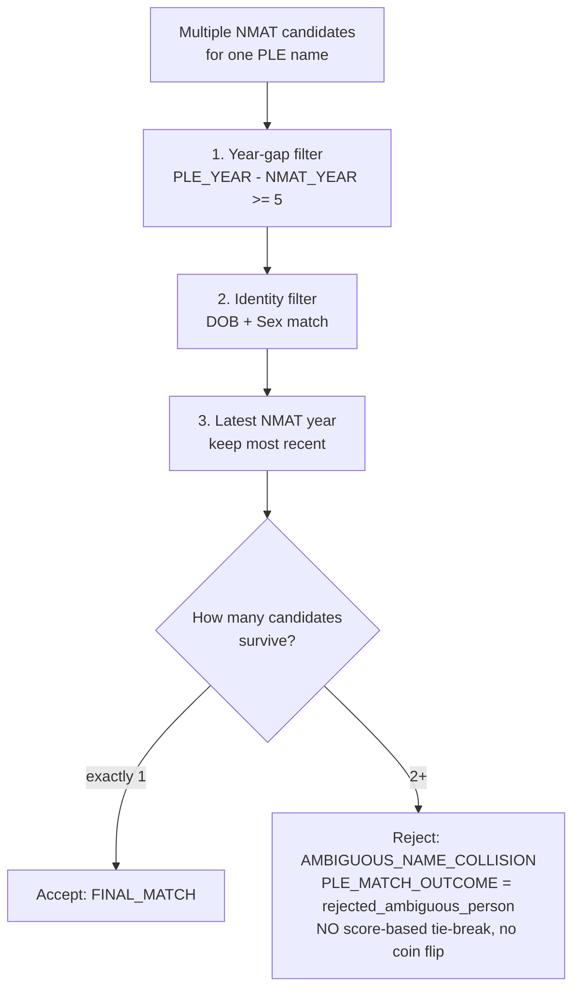
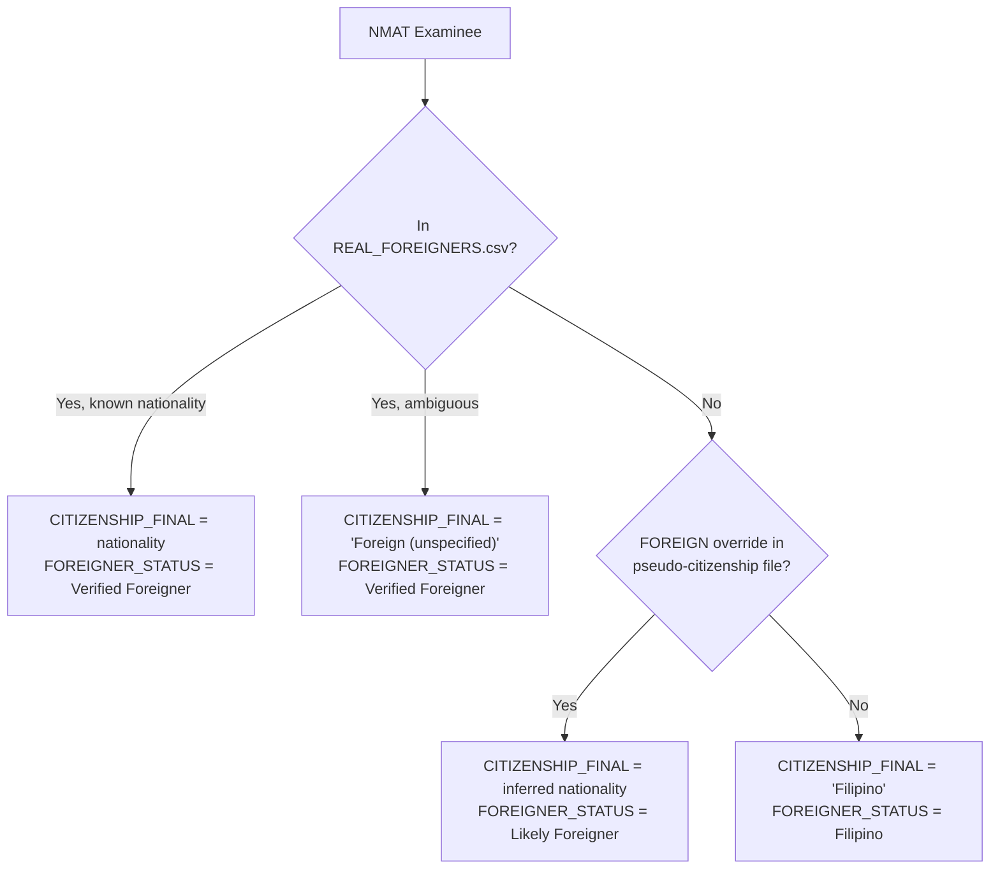

# NMAT Analysis — Pipeline Architecture

## End-to-End Data Transformation Documentation

**Last updated:** 2026-08-14 (post-remediation rewrite)
**Final output:** `dataset/NMAT_Exodus.parquet` (53 columns, 178,927 rows, md5 `28b85ac53af13b4a2ef3ee93527c97c1`)
**Total examinees:** 178,927 exam sittings, 134,869 unique people, covering NMAT 2006-2018

This document replaces an earlier version that described a 4-pipeline, 54-column system. That
description no longer matches the code or the shipped file: the chain is **5 pipelines**, the
shipped file is **53 columns**, and two of the pipeline's own defects — not merely documentation
errors — were found and fixed during a 2026-07/08 remediation pass. This document describes the
system as it exists now, and calls out what changed and why.

---

## Table of Contents

1. [System Overview](#1-system-overview)
2. [Pipeline 1: Data Cleaning & Score Recalibration](#2-pipeline-1-data-cleaning--score-recalibration)
3. [Pipeline 2: PLE Matching](#3-pipeline-2-ple-matching)
4. [Pipeline 3: Statistical Analysis](#4-pipeline-3-statistical-analysis)
5. [Pipeline 4: Citizenship Integration](#5-pipeline-4-citizenship-integration)
6. [Pipeline 5: Slim Exodus](#6-pipeline-5-slim-exodus)
7. [The Two Defects That Mattered Most](#7-the-two-defects-that-mattered-most)
8. [Key Decisions & Corrections](#8-key-decisions--corrections)

---

## 1. System Overview



Pipeline 3 (statistical analysis) reads Pipeline 2's output directly and writes its own
`analysis_output/` artifacts; it is **not** on the path that produces the shipped Exodus file —
Pipelines 4 and 5 branch off Pipeline 2's output independently.

**Column counts over the chain:**

| Stage | File | Columns |
|-------|------|--------:|
| Raw NMAT input | `NMAT_CLEANED_DATA.csv` | 29 |
| After Pipeline 1 | `NMAT_FINAL.csv` | 101 |
| After Pipeline 2 | `NMAT_Ultima.parquet` | 119 |
| After Pipeline 4 | `NMAT_Exodus.parquet.bak` | 118 |
| After Pipeline 5 | **`NMAT_Exodus.parquet`** | **53** |

Pipeline 1 also writes a `dataset/output/NMAT_FINAL.parquet` twin; it has no reader anywhere in
the repo (Pipeline 2 opens the `.csv`) and was removed in the 2026-08 dataset-hygiene cleanup — do
not expect it on disk.

---

## 2. Pipeline 1: Data Cleaning & Score Recalibration

**File:** `1_Data_Cleaning_Pipeline.ipynb`

### Inputs

| File | Rows | Description |
|------|-----:|-------------|
| `NMAT_CLEANED_DATA.csv` | 178,927 | Raw NMAT registration & score data |
| `CEM_DATA.csv` | 254,308 | Component-level score records from the Center for Educational Measurement |
| `UNIVS.csv` | ~3,022 | University reference table |

### Key transformations

- **Application-number cleaning** to `APPNO_CLEAN` (the join key used by every later pipeline).
- **University name normalization**, a 4-tier cascade against `UNIVS.csv` (exact primary key,
  exact secondary key, `rapidfuzz` fuzzy match at score >= 88, else unmatched/"Not Specified").
  2,981 of 4,367 raw college strings matched (68.3%); 235 of those matches came from the fuzzy
  tier. This is the **only** fuzzy matching anywhere in the project — Pipeline 2's PLE matching
  is deterministic-only (see below), and this document should not be read as implying otherwise.
- **TRUE raw score recalculation.** The CEM data carries two raw-score totals: `STU_RSCORE`
  (stored) and `STU_RSCORE_CALC` (calculated). The stored total disagrees with the recalculated
  total (`TotalRawScoreTRUE`, the sum of 8 component subscores) in **56,065 of the 99,316 rows
  that have a stored total at all — 56.45%** (31.33% of all 178,927 rows). **The figure "42.2%"
  seen elsewhere in this project is **also correct — it is a different population.** Measured on
  `CEM_DATA.csv`: `STU_RSCORE != STU_RSCORE_CALC` on **107,422 of 254,308 rows = 42.24% of the
  whole CEM file**, versus **56.45% of the 99,316 NMAT-matched rows that carry a stored total**
  (31.33% of all 178,927 rows). Neither figure supersedes the other; always name the denominator.
  **CEM had already flagged every one of them**: `STU_RSCORE_VALID` marks exactly those 107,422
  rows `INVALID`, a perfect predictor with zero exceptions in either direction. The recalculation
  therefore reproduces a QA judgement the source system already published — it is correct and worth
  doing, but "we discovered that 42.2% were wrong" overstates its novelty.
- **`PercentileBin`** created via `pd.cut()`, labels `B1`-`B10`, left-closed intervals. **`B1` is
  the lowest decile, `B10` the highest** — confirmed monotonic against mean raw score.
- **Course group classification** into 6 categories via keyword matching.

### Output

`NMAT_FINAL.csv`, 178,927 rows x 101 columns — the file Pipeline 2 actually reads. (A
`dataset/output/NMAT_FINAL.parquet` twin used to exist; it had zero readers anywhere in the repo
and was removed in dataset cleanup — do not document it as a live output.)

---

## 3. Pipeline 2: PLE Matching

**File:** `2_PLE_Matching_Pipeline.ipynb`

### Inputs

| File | Description |
|------|-------------|
| `NMAT_FINAL.csv` | Cleaned NMAT data from Pipeline 1 |
| `PLE_DATA.csv` | PLE passer records |
| `PLE_UNMATCHED.csv`, `PLE_STILL_UNMATCHED.csv` | Residual unmatched PLE records for the AppNo-based stages |

### Deterministic-only matching

No fuzzy/`rapidfuzz` matching anywhere in this pipeline (that refactor predates this document and
remains true). A 3-stage cascade — Stage 0 manual AppNo recovery, Stage 1 exact name match, Stage
2 deterministic AppNo — produces every candidate match. When a name resolves to more than one
NMAT candidate, `disambiguate()` (cell 6) decides which one, if any, is accepted.

### `disambiguate()` — the current, corrected logic



Steps 1-3 are identity evidence; there is **no fourth or fifth step that decides on score**. This
is a deliberate, hard-won property of the current pipeline — see §7 below for what used to be
there and why it mattered.

**Funnel over the 13,895 name-collision groups that reach `disambiguate()`:**

```
13,895 groups entering disambiguate()
    1 rejected at Step 1 (all candidates fail the year-gap check)
10,316 resolved to exactly one candidate by Steps 1-3
 3,578 still have 2+ survivors -> AMBIGUOUS_NAME_COLLISION, rejected
```

Single exact-name matches (the majority of matches) never enter `disambiguate()` at all — they
receive only the year-gap check.

### Match results (current, post-fix)

| Status | Rows |
|--------|-----:|
| `IS_PLE_PASSER == True` (accepted) | **49,086** |
| `rejected_ambiguous_person` (2+ survivors, no accept) | 8,216 |
| `no_match` (no candidate at all) | 121,623 |
| `rejected` | 2 |

`PLE_MATCH_METHOD` breakdown among accepted+near-accepted rows: `EXACT` 54,437,
`MANUAL_APPNO_MATCH` 2,775, `DETERMINISTIC_APPNO` 92.

### Observable cohort

`IS_OBSERVABLE_COHORT` = `Year <= 2014` — enough elapsed time for a plausible PLE attempt. Do not
confuse this row-level flag with the person-level cohort; see `IS_BEST_OBSERVABLE_RECORD` in
`data_dictionary.md` and §7 below.

**Cohort sizes (current, post-fix):** 69,503 people in the observable cohort
(`IS_BEST_OBSERVABLE_RECORD`), 45.44% observable linkage rate.

### Output

`NMAT_Ultima.parquet`, 178,927 rows x 119 columns; `PLE_MATCH_MASTER.csv`.

---

## 4. Pipeline 3: Statistical Analysis

**File:** `3_NMAT_PLE_Analysis.ipynb`

Reads `NMAT_Ultima.parquet` and writes ~95 output files (CSV + PNG) to
`dataset/analysis_output/` across 13 sections: yearly trends & stability (Kruskal-Wallis), bin
distributions by background (Chi-square), Sankey flow pathways, PLE alignment (Mann-Whitney U),
repeat-taker trajectories, subtest profiles, gender analysis, Dunn post-hoc tests, and policy
summary tables.

This pipeline is analysis-only — its outputs are not consumed by the shipped
`NMAT_Exodus.parquet` and are not part of the data-production chain for the dashboards. It is
independent of, and unaffected by, Pipelines 4 and 5.

### Best-record filtering

`IS_BEST_NMAT_RECORD` selects exactly one row per person. As of this remediation it applies **one
uniform rule to every person** — highest `NMS_PER_num` -> latest `Year` -> lowest `APPNO_CLEAN` —
rather than an earlier version that used a different rule for PLE passers than for everyone else
(which silently dropped 1,311 people from every person-level count and double-counted 246 more).
25% of examinees took NMAT 2+ times (max 9 attempts) and would otherwise violate the independence
assumptions of the statistical tests used here.

---

## 5. Pipeline 4: Citizenship Integration

**File:** `4_Citizenship_Integration.py`

### Inputs

| File | Rows | Description |
|------|-----:|-------------|
| `NMAT_Ultima.parquet` | 178,927 | Base dataset from Pipeline 2 |
| `REAL_FOREIGNERS.csv` | 32,501 | Ground-truth citizenship records |
| `pseudo_citizenship_profiling_FINAL.csv` | 871 | Name-based citizenship inference |

### The 3-tier hierarchy



| Tier | Records | `FOREIGNER_STATUS` |
|:----:|--------:|---------------------|
| 1 — REAL_FOREIGNERS (known nationality) | 32,345 | Verified Foreigner |
| 1b — REAL_FOREIGNERS (ambiguous, labeled `Foreign (unspecified)`) | 156 | Verified Foreigner |
| 2 — Pseudo-citizenship inference | 13 | Likely Foreigner |
| 3 — Default | 146,413 | Filipino |

`name_based_assessment`, the free-text field from the pseudo-citizenship file, is dropped by this
pipeline before writing its output — it was non-null for only 871/178,927 rows (0.5%), was never
consulted by the tier decision above, and disagreed with the final label in 23 of those 871 rows.
It never reaches `NMAT_Exodus.parquet`.

### Output

`NMAT_Exodus.parquet.bak`, 178,927 rows x 118 columns — the **wide** intermediate file. This is
not the shipped file; Pipeline 5 reads it.

---

## 6. Pipeline 5: Slim Exodus

**File:** `5_Slim_Exodus.py` — the pipeline this document's predecessor did not know existed.

Before this script existed, the shipped 54-column `dataset/NMAT_Exodus.parquet` had **no
generating code at all**: someone had hand-selected 54 columns from Pipeline 4's wide output, and
the selection existed only as prose in an earlier version of this document. `5_Slim_Exodus.py`
makes that step explicit, deterministic, and asserted — reading `NMAT_Exodus.parquet.bak`,
applying the column selection / rename / dtype-coercion contract, and writing the canonical
`NMAT_Exodus.parquet` plus byte-identical copies into both dashboard folders.

### What it does

1. Selects the target 53 columns (removes 6, adds 5 — see `data_dictionary.md` for the full
   list and rationale of each).
2. Renames 4 columns to their `UNDERGRAD_*` form.
3. Coerces `HasTRUErawScores` and `StoredVsDerivedMismatch` from `str` to nullable `boolean`.
4. Runs two tiers of assertions:
   - **Structural (`check_hard`)** — correctness that must hold regardless of today's data:
     row/column counts, one best-record per person, `IS_OBSERVABLE_COHORT` correctness and
     non-tautology, raw-score arithmetic identity, dropped columns actually absent, dtype
     coercions actually landed, all 3 copies byte-identical. A failure here raises `SystemExit`
     and blocks the chain.
   - **Reference (`check_soft`)** — today's headline numbers (unique people, observable cohort
     size, ambiguous-key count, passer count, linkage-rate band). A mismatch prints a loud
     `WARNING` and is recorded in `dataset/EXODUS_MANIFEST.json`'s `reference_count_deltas`
     block, but does **not** block the chain — an upstream fix that legitimately moves a
     headline number (as happened here, see §7) must not be blocked by a stale reference value.
5. Writes `dataset/EXODUS_MANIFEST.json`: row/column counts, md5, full column list, and any
   reference-count deltas, so drift between the canonical file and its dashboard copies — or
   between today's numbers and yesterday's — is always visible, never silent.

### Output

`dataset/NMAT_Exodus.parquet` + 2 dashboard-folder copies, 178,927 rows x 53 columns, all sharing
md5 `28b85ac53af13b4a2ef3ee93527c97c1`.

---

## 7. The Two Defects That Mattered Most

Both were found *during* this remediation, in code, not in the original 12-agent documentation
audit that preceded it — both are worth understanding because they explain why several headline
numbers in this project's history do not match the numbers in this document.

### RC-0 — the matcher refused to match examinees below the 40th percentile

`disambiguate()` used to have a **Step 4**, between the identity checks (Steps 1-3) and a
score-based tie-break (the old Step 5):

```python
PERCENTILE_FLOOR = 40
pct_pass = [r for r in latest_pass if r["NMS_PER_num"] >= PERCENTILE_FLOOR]
if not pct_pass:
    return {"status": "NO_VALID_MATCH", "reason": "Percentile < 40 for all candidates"}
```

This was a **hard filter, not a tie-break**: among name-collision groups it discarded every
candidate scoring below the 40th percentile, and rejected the match outright when every candidate
fell below 40. The constant is exactly the CMO cut-off percentile this project exists to evaluate
— the policy under review was baked into the identity-resolution step that produces the evidence
for evaluating it. It was found only because a remediation agent's passer counts would not
reconcile and the underlying predicate was read directly rather than trusted from documentation.

**Fix:** Step 4 deleted outright. Identity now resolves purely on year-gap, DOB/sex, and latest
year; ties are rejected as ambiguous, never decided by score.

**Measured effect** (person-level observable linkage rate by bin, before vs. after):

| Bin | Before (biased matcher) | After (corrected) | Change |
|---|---|---|---|
| B1 | 8.1% | **11.6%** | +3.5 |
| B2 | 16.0% | **22.7%** | +6.7 |
| B3 | 21.1% | **29.3%** | +8.2 |
| B4 | 25.9% | **36.0%** | +10.1 |
| B5 | 46.8% | **45.6%** | -1.2 |
| B6 | 52.9% | **50.4%** | -2.5 |
| B7 | 58.0% | **53.6%** | -4.4 |
| B8 | 61.3% | **55.0%** | -6.3 |
| B9 | 68.0% | **61.6%** | -6.4 |
| B10 | 76.6% | **71.0%** | -5.6 |

Exactly the predicted two-directional movement: below-40 bins gained (they had been suppressed),
above-40 bins lost (they had been absorbing collisions they had not earned).

**A previously-reported finding is withdrawn as a result.** Earlier project history described a
sharp 21-point "policy discontinuity" between B4 and B5, and recommended a regression
discontinuity design built on it. Corrected, that step is **9.6 points** — in line with B1->B2
(+11.1) and B9->B10 (+9.4), not an outlier. The discontinuity was mostly an artefact of the
matcher's own percentile floor, not of the admission policy it was thought to reveal. If you have
seen the B4->B5 discontinuity or an RDD recommendation built on it cited elsewhere in this
project's history, treat it as superseded.

**The current headline finding, which replaces it:** among the 25,596 observable-cohort people
scoring below the 40th percentile at their best attempt, **6,173 (24.1%) are confirmed PLE
passers** — 795 of them in the lowest decile (B1). This survives the obvious objections: the
ambiguous-key rate among them (3.0%) is *below* the cohort base rate (3.5%), so it is not a
collision artefact; 6,152 of 6,173 are Filipino, not a foreign-student exemption effect; and they
are spread across all nine observable years, not concentrated in one anomalous year.

### O-24 — the documented DOB check was dead code

Every version of this project's documentation, including earlier drafts of this file, described
Step 2 of `disambiguate()` as a birthdate/sex identity check — "the backbone of the deterministic
disambiguator." It never ran. `BDATE_CLEAN` was added to the working DataFrame **after** the
row-dict snapshot that `disambiguate()`'s candidate lists are built from; a column added to a
DataFrame after `.to_dict("records")` is called never appears in the already-created dicts. So
`r.get("BDATE_CLEAN", "")` returned the default empty string for every candidate, in every call,
in every historical run of this pipeline — Step 2 always fell through to "no DOB available, keep
all candidates," regardless of whether real birthdate data existed for 85.91% of rows.

**Consequence:** with DOB dead, the percentile floor (RC-0, above) became the *de facto*
discriminator wherever identity could not be resolved by year-gap alone. Two independent defects
were both pushing identity resolution onto score.

**Fix:** the `BDATE_CLEAN` assignment was moved before the row-dict snapshot, so Step 2 filters on
real birthdate data for the first time in this pipeline's history.

**Combined effect of both fixes:** `IS_PLE_PASSER` moved from 49,986 to **49,086** (net -900,
-1.8% — the sum of several partially-offsetting movements: candidates newly resolved by Steps 1-3
alone gained, candidates that used to be narrowed by the percentile floor before a tie-break now
face a larger unresolved pool and are rejected as ambiguous instead). If you see 49,986 cited
elsewhere in this project's history as the passer count, it predates this fix; **49,086 is
current.**

---

## 8. Key Decisions & Corrections

| Decision / correction | Detail |
|---|---|
| Deterministic-only PLE matching | No fuzzy/`rapidfuzz` matching in Pipeline 2 (university-name matching in Pipeline 1 still uses it, disclosed above). |
| No score-based identity resolution | RC-0's percentile floor removed; the old Step-5 score tie-break was already removed in an earlier refactor and was not reintroduced. `disambiguate()` now rejects ties rather than breaking them. |
| DOB check fixed | O-24 — the check now actually runs. |
| `IS_BEST_NMAT_RECORD` unified | One rule for every person, not a passer/non-passer split. |
| `IS_BEST_OBSERVABLE_RECORD` added | The correct observable-cohort flag; do not substitute `IS_BEST_NMAT_RECORD & (Year<=2014)`, which drops 3,721 people. |
| `PERSON_KEY_AMBIGUOUS` added | Exposes, rather than hides, ~4.56% (6,148) detectable name-collision risk in the underlying `PERSON_KEY`. |
| Undergraduate-institution renames | `UNIVERSITY`/`UNI_TYPE`/`UNI_LOCATION`/`CourseGroup` -> `UNDERGRAD_*`, because this data has no medical-school identifier at all — see `data_dictionary.md`. |
| Stored-total mismatch corrected | 56.45% of the 99,316 rows with a stored total; equivalently 42.24% of the whole CEM file (107,422/254,308). Both correct — name the denominator. See §2. |
| Pipeline 5 added | The previously-undocumented, code-less slimming step now has a real, asserted script. |

---

## Live vs. legacy consumers

`NMAT_Exodus.parquet` is consumed by:
- **`streamlit_dashboard/main_dashboard/`** — live, maintained.
- **`streamlit_dashboard/CHED_relevant_dashboard/`** — live, maintained.
- **`data_aggregator/`** — live, maintained; produces static markdown reports.

The following are **legacy** — retained for reference, not actively maintained, and should not be
presented as reflecting the current schema or matching logic without independent verification:
`RShiny_Dashboard/`, `reports/`, and the root `dashboard.py` / `dashboard.py.bak`.

---

*Pipeline architecture for `dataset/NMAT_Exodus.parquet` (53 columns, 178,927 rows), rewritten
2026-08-14 against the live code and data as part of the post-remediation documentation pass.*
