# NMAT Performance Evidence for CHED Cut-Off Policy Review

> Complete Markdown export generated 2026-07-31 16:32. Every number below is computed by the same functions the live dashboard renders from (`ched_common.py`) — this document is a faithful transcript, not a paraphrase.

**Source:** NMAT_Exodus.parquet, 178,927 rows x 53 columns.

## How to Read This Document

- **Best-record examinees** — one NMAT record per person (removes repeat-taker inflation).
- **Observable cohort** — each person's best NMAT attempt with Year <= 2014 (`IS_BEST_OBSERVABLE_RECORD`), who has had time to take the PLE. This is NOT the same as filtering the overall-best record to Year<=2014.
- **Score bins** — B1 (0-9, lowest) through B10 (90-100, highest). B4+ = Bin 4 and above (30th-39th). B5+ = Bin 5 and above (40th-49th). Always ordered B1..B10, never string-sorted.
- **NMAT-to-PLE linkage** — the proportion of NMAT examinees later matched to PLE passer records. This is NOT a PLE pass rate. The dataset does not contain all PLE takers or PLE failures.
- **People vs sittings** — best-record filtering counts people; unfiltered counts count exam sittings.
- **No medical-school identifier exists in this dataset.** UNDERGRAD_UNI_TYPE / UNDERGRAD_UNIVERSITY describe the examinee's undergraduate institution, never the medical school.
- **Nationality shares** use the full verified-foreigner denominator, never a top-N subtotal.

## Global KPIs

| Metric | Value | Population | Note |
|---|---|---|---|
| Total NMAT sittings | 178,927 | all years | - |
| Unique examinees | 134,869 | best-record | - |
| Observable cohort | 69,503 | best attempt, Year<=2014 | >=~5yr PLE window |
| Confirmed PLE passers (observable) | 31,581 | observable cohort | - |
| Repeat takers | 33,713 (25%) | unique examinees | - |

---

# Tab 1 — National Profile

| Metric | Value | Population | Note |
|---|---|---|---|
| Best-record examinees | 134,869 | one row per person | - |
| Unique persons (PERSON_KEY) | 134,869 | one row per person | equal to best-record examinees by construction |
| NMAT years covered | 13 | - | - |
| Median NMAT percentile | 50.0 | best-record examinees | 0-99 scale, not a bin number |
| Repeat takers | 33,713 (25%) | unique examinees | took NMAT more than once |

---

## Annual Trend

### Examinee Volume by Year / Median NMAT Percentile by Year

<!-- chart_type: bar+line | x: Year | y: Examinees, Median NMAT percentile | series: none
     population: best-record examinees, all years
     n: 134,869 | denominator: one row per person
     source_tab: 1 | element_id: ched_t1_fig1 -->

Two-panel chart: examinee count (bar) and median NMAT percentile, 0-99 scale (line), by NMAT year.

|   Year |   Examinees |   Median NMAT percentile |   Median TRUE raw score |
|-------:|------------:|-------------------------:|------------------------:|
|   2006 |       3,698 |                       53 |                     131 |
|   2007 |       3,690 |                       52 |                     130 |
|   2008 |       4,965 |                       54 |                     129 |
|   2009 |       7,461 |                       52 |                     130 |
|   2010 |       8,551 |                       57 |                     136 |
|   2011 |       8,701 |                       52 |                     129 |
|   2012 |       9,113 |                       54 |                     122 |
|   2013 |       9,148 |                       60 |                     128 |
|   2014 |      10,455 |                       57 |                     120 |
|   2015 |      10,326 |                       52 |                     118 |
|   2016 |      12,480 |                       48 |                     123 |
|   2017 |      23,948 |                       44 |                     118 |
|   2018 |      22,333 |                       43 |                     111 |

---

## University Type Composition

<!-- chart_type: pie | x: UNDERGRAD_UNI_TYPE | y: Count | series: none
     population: best-record examinees
     n: 134,869 | denominator: best-record examinees
     source_tab: 1 | element_id: ched_t1_fig2 -->

| UNDERGRAD_UNI_TYPE   |   Count |   Share (%) |
|:---------------------|--------:|------------:|
| Private              | 103,669 |        76.9 |
| Public               |  27,916 |        20.7 |
| Foreign              |   1,892 |         1.4 |
| Not Specified        |   1,392 |           1 |

---

## Course Group Composition

<!-- chart_type: pie | x: UNDERGRAD_COURSE_GROUP | y: Count | series: none
     population: best-record examinees
     n: 134,869 | denominator: best-record examinees
     source_tab: 1 | element_id: ched_t1_fig3 -->

| UNDERGRAD_COURSE_GROUP       |   Count |   Share (%) |
|:-----------------------------|--------:|------------:|
| Medical & Allied             |  64,287 |        47.7 |
| Natural Sciences             |  41,514 |        30.8 |
| Social & Behavioral Sciences |  16,492 |        12.2 |
| Other                        |   8,346 |         6.2 |
| Education                    |   3,479 |         2.6 |
| Engineering & Technology     |     751 |         0.6 |

---

## Repeat-Taker Context

Of 134,869 unique examinees, 33,713 (25%) took the NMAT more than once (up to 9 attempts). All threshold counts use each examinee's best-record NMAT attempt to avoid inflating the applicant pool with repeat attempts.

---

## Score Bin Reference

B1 is the lowest decile (0-9), B10 the highest (90-100).

| Bin   | Score Range   | Threshold                 |
|:------|:--------------|:--------------------------|
| B1    | 0-9           |                           |
| B2    | 10-19         |                           |
| B3    | 20-29         |                           |
| B4    | 30-39         | CMO exception floor (B4+) |
| B5    | 40-49         | SUC standard floor (B5+)  |
| B6    | 50-59         |                           |
| B7    | 60-69         |                           |
| B8    | 70-79         |                           |
| B9    | 80-89         |                           |
| B10   | 90-100        |                           |

---

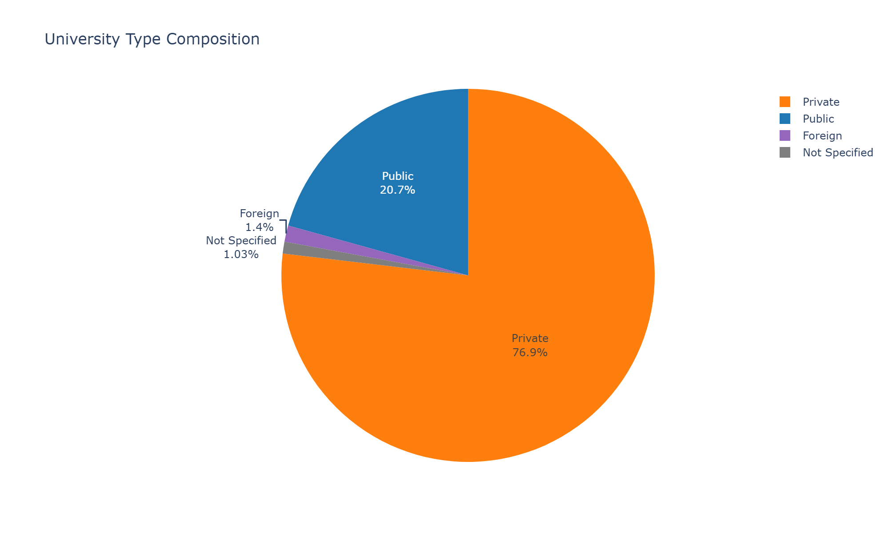

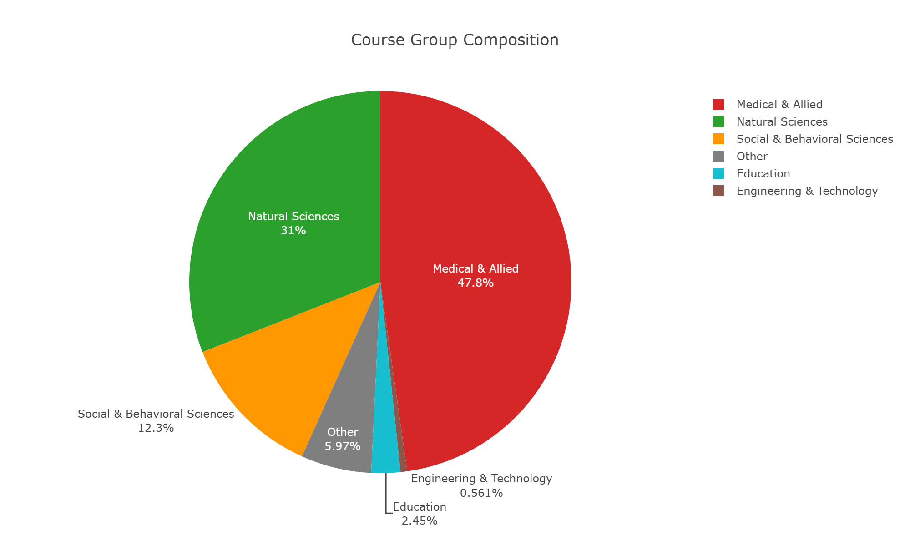

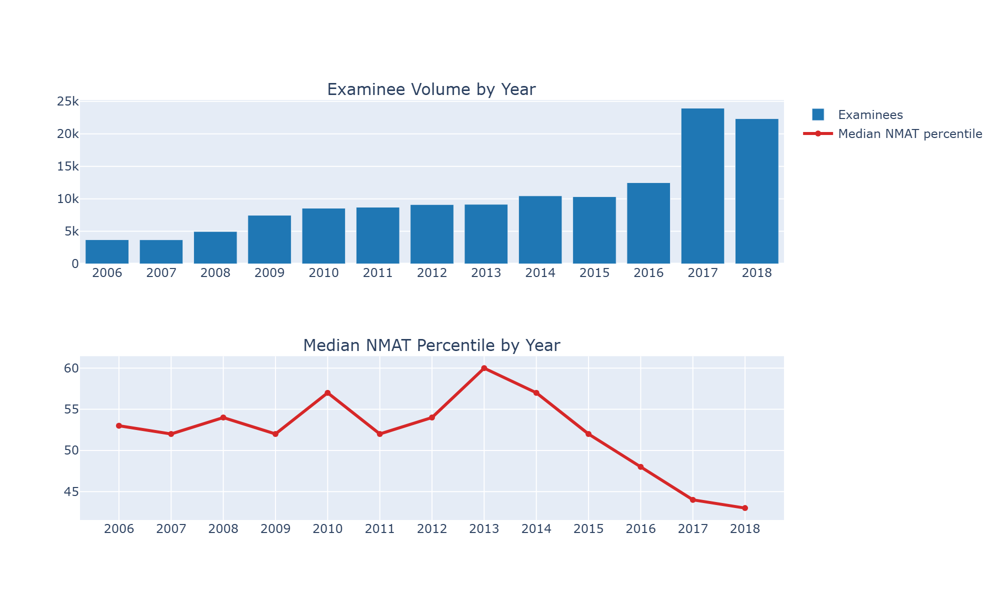

# Tab 2 — B4+ vs B5+ Thresholds

## Score Bin Distribution by NMAT Year

<!-- chart_type: heatmap | x: Year | y: PercentileBin | series: ched_t2_fig1
     population: row %
     n: best-record, valid bin | denominator: 131,845
     source_tab: best-record examinees with a valid percentile bin | element_id: 2 -->

Row percentages. Rows = NMAT years, columns = score bins (B1 lowest, B10 highest).

|   Year |   B1 |   B2 |   B3 |   B4 |   B5 |   B6 |   B7 |   B8 |   B9 |   B10 |
|-------:|-----:|-----:|-----:|-----:|-----:|-----:|-----:|-----:|-----:|------:|
|  2,006 |  8.7 |  8.8 |  9.3 |  9.6 |   10 | 10.1 |  9.7 | 10.2 | 10.8 |  12.6 |
|  2,007 |  8.8 |  8.6 |  9.7 | 10.8 | 10.1 |  8.2 |  9.8 | 10.5 | 11.1 |  12.3 |
|  2,008 |  8.8 |  8.4 |    8 |  9.6 | 10.1 | 10.5 |   10 |  9.5 | 10.9 |  14.2 |
|  2,009 |  7.9 |  8.8 |  9.8 | 10.8 |  9.6 | 10.8 | 10.2 |  9.7 |  9.9 |  12.5 |
|  2,010 |  6.2 |  7.4 |  8.6 |  8.8 | 10.4 | 10.8 |  9.7 | 10.7 | 11.9 |  15.6 |
|  2,011 |  6.5 |  8.7 |  9.3 | 11.2 |   12 | 10.4 |  9.8 | 10.8 | 10.3 |    11 |
|  2,012 | 10.9 |  8.7 |    8 |  8.8 |  9.9 |  8.4 |  8.9 |  9.2 | 10.3 |    17 |
|  2,013 | 12.4 |  7.9 |  6.4 |    7 |  8.1 |  7.2 |  8.6 | 10.3 | 11.8 |  20.3 |
|  2,014 | 12.9 |  7.1 |  6.8 |  7.3 |  8.2 |  8.4 |  9.7 | 10.3 | 11.7 |  17.6 |
|  2,015 | 14.6 |  7.4 |  7.4 |  7.2 |  9.2 |  9.2 | 10.5 |  9.9 | 10.6 |    14 |
|  2,016 | 14.2 |  9.6 |    8 |  8.6 | 10.4 | 10.8 |  9.6 |  9.9 |   10 |   8.9 |
|  2,017 | 13.1 | 11.7 |  9.9 | 11.2 |  8.7 | 10.2 |  9.3 |  9.3 |  8.8 |   7.7 |
|  2,018 | 14.9 | 11.3 |  9.7 | 10.7 |  9.9 |  9.8 |  8.3 |  8.3 |  8.2 |   8.9 |

---

## Examinees Meeting Each Threshold

<!-- chart_type: table | x: Threshold | y: Best-record examinees | series: none
     population: -
     n: 131,845 | denominator: best-record examinees with a valid percentile bin
     source_tab: 2 | element_id: ched_t2_table1 -->

| Threshold             |   Best-record examinees |   Share of all (%) |   Observable cohort size |
|:----------------------|------------------------:|-------------------:|-------------------------:|
| B4+ (Bin 4 and above) |                  92,437 |               70.1 |                   49,623 |
| B5+ (Bin 5 and above) |                  79,848 |               60.6 |                   43,150 |
| B4 only (Bin 4)       |                  12,589 |                9.5 |                    6,473 |

---

## Threshold Context by University Type

<!-- chart_type: table | x: University Type | y: B4+/B5+/B4-only counts | series: none
     population: -
     n: 131,845 | denominator: best-record examinees with a valid percentile bin
     source_tab: 2 | element_id: ched_t2_table2 -->

| University Type   |   Best-record examinees |   B4+ count |   B4+ (%) |   B5+ count |   B5+ (%) |   B4-only count |   B4-only (%) |
|:------------------|------------------------:|------------:|----------:|------------:|----------:|----------------:|--------------:|
| Public            |                  27,234 |      19,999 |      73.4 |      17,752 |      65.2 |           2,247 |           8.3 |
| Private           |                 101,400 |      70,245 |      69.3 |      60,184 |      59.4 |          10,061 |           9.9 |
| Foreign           |                   1,860 |       1,284 |        69 |       1,108 |      59.6 |             176 |           9.5 |
| Not Specified     |                   1,351 |         909 |      67.3 |         804 |      59.5 |             105 |           7.8 |
**No medical-school identifier exists in this dataset.** `UNDERGRAD_UNI_TYPE` records the examinee's *undergraduate* institution, not the medical school they attended, and cannot serve as a proxy for CMO §IV.B's SUC-vs-PHEI distinction or for GIDA/IP disadvantage status. No PHEI-level, SUC-vs-PHEI, or per-institution PLE-performance claim can be made from any column in this file.

---

## Public-Institution Examinees and B5+ Threshold (Descriptive Only)

| Metric | Value | Population | Note |
|---|---|---|---|
| Public B5+ count | 17,752 | public examinees, n=27,234 | 65.2% |
| Public B4-only count | 2,247 | public examinees, n=27,234 | 8.3% |
| Private B5+ count | 60,184 | private examinees, n=101,400 | 59.4% |
| Metric                      | Public         | Private        |
|:----------------------------|:---------------|:---------------|
| Total best-record examinees | 27,234         | 101,400        |
| B5+ (Bin 5+)                | 17,752 (65.2%) | 60,184 (59.4%) |
| B4-only                     | 2,247 (8.3%)   | 10,061 (9.9%)  |
Purely descriptive. Whether this band overlaps with GIDA/IP applicants cannot be determined from this dataset: GIDA/IP status is not recorded, 'public undergraduate institution' is not a GIDA/IP indicator, and 'public' is not equivalent to 'SUC' as the CMO uses the term. No claim about who benefits from the exception is supported by this data.

---

## Profile of the B4 Group (Bin 4 Only)

| Metric | Value | Population | Note |
|---|---|---|---|
| B4 examinees (best record) | 12,589 | B4 bin only | - |
| Median TRUE raw score | 109.0 | B4 bin only | - |
| UNDERGRAD_UNI_TYPE   |   count |   share (%) |
|:---------------------|--------:|------------:|
| Foreign              |     176 |         1.4 |
| Not Specified        |     105 |         0.8 |
| Private              |  10,061 |        79.9 |
| Public               |   2,247 |        17.8 |

---

## Top Bins (B8-B10) vs Bottom Bins (B1-B3) Trend

<!-- chart_type: line | x: Year | y: Top/Bottom bin share (%) | series: none
     population: best-record examinees by year
     n: 134,869 | denominator: best-record examinees
     source_tab: 2 | element_id: ched_t2_fig4 -->

|   Year |   Top B8-B10 (%) |   Bottom B1-B3 (%) |   Difference (pp) |
|-------:|-----------------:|-------------------:|------------------:|
|   2006 |             33.6 |               26.9 |               6.7 |
|   2007 |             33.9 |               27.1 |               6.8 |
|   2008 |             34.6 |               25.2 |               9.4 |
|   2009 |             32.1 |               26.5 |               5.5 |
|   2010 |             38.2 |               22.2 |                16 |
|   2011 |             32.2 |               24.5 |               7.7 |
|   2012 |             36.5 |               27.6 |               8.9 |
|   2013 |             42.3 |               26.8 |              15.6 |
|   2014 |             39.6 |               26.8 |              12.7 |
|   2015 |             34.5 |               29.4 |               5.1 |
|   2016 |             28.9 |               31.7 |              -2.9 |
|   2017 |             25.9 |               34.6 |              -8.7 |
|   2018 |             25.5 |               35.8 |             -10.4 |

---

## Yearly Examinees Meeting Each Threshold

|   Year |   Total (best record) |   B4+ count |   B4+ (%) |   B5+ count |   B5+ (%) |   Observable B4+ |   Observable B5+ |
|-------:|----------------------:|------------:|----------:|------------:|----------:|-----------------:|-----------------:|
|  2,006 |                 3,675 |       2,687 |      73.1 |       2,333 |      63.5 |            2,687 |            2,333 |
|  2,007 |                 3,665 |       2,671 |      72.9 |       2,274 |        62 |            2,671 |            2,274 |
|  2,008 |                 4,947 |       3,700 |      74.8 |       3,224 |      65.2 |            3,700 |            3,224 |
|  2,009 |                 7,438 |       5,465 |      73.5 |       4,660 |      62.7 |            5,465 |            4,660 |
|  2,010 |                 8,529 |       6,640 |      77.9 |       5,891 |      69.1 |            6,680 |            5,922 |
|  2,011 |                 8,649 |       6,531 |      75.5 |       5,564 |      64.3 |            6,617 |            5,634 |
|  2,012 |                 8,852 |       6,407 |      72.4 |       5,630 |      63.6 |            6,535 |            5,718 |
|  2,013 |                 8,748 |       6,406 |      73.2 |       5,796 |      66.3 |            6,723 |            6,025 |
|  2,014 |                10,016 |       7,328 |      73.2 |       6,597 |      65.9 |            8,545 |            7,360 |
|  2,015 |                 9,740 |       6,877 |      70.6 |       6,180 |      63.4 |                0 |                0 |
|  2,016 |                12,141 |       8,287 |      68.3 |       7,246 |      59.7 |                0 |                0 |
|  2,017 |                23,612 |      15,433 |      65.4 |      12,783 |      54.1 |                0 |                0 |
|  2,018 |                21,833 |      14,005 |      64.1 |      11,670 |      53.5 |                0 |                0 |

---

## B5+ PLE-Passer Composition by Year

NOT pre-filtered on match status — population is the full B5+ observable cohort, so 'no confirmed match' is a genuine, non-tautological count that varies by year.

<!-- chart_type: bar (stacked, count+percent) | x: Year | y: confirmed/no_match | series: ched_t2_fig5
     population: none
     n: B5+ observable cohort, all years | denominator: 43,150
     source_tab: B5+ examinees in the observable cohort, by year | element_id: 2 -->

|   Year |   Total B5+ observable |   Confirmed PLE passers |   No confirmed PLE match |   Linkage rate (%) |   No-match share (%) |
|-------:|-----------------------:|------------------------:|-------------------------:|-------------------:|---------------------:|
|  2,006 |                  2,333 |                   1,495 |                      838 |               64.1 |                 35.9 |
|  2,007 |                  2,274 |                   1,355 |                      919 |               59.6 |                 40.4 |
|  2,008 |                  3,224 |                   2,012 |                    1,212 |               62.4 |                 37.6 |
|  2,009 |                  4,660 |                   2,791 |                    1,869 |               59.9 |                 40.1 |
|  2,010 |                  5,922 |                   3,715 |                    2,207 |               62.7 |                 37.3 |
|  2,011 |                  5,634 |                   3,135 |                    2,499 |               55.6 |                 44.4 |
|  2,012 |                  5,718 |                   3,186 |                    2,532 |               55.7 |                 44.3 |
|  2,013 |                  6,025 |                   3,435 |                    2,590 |                 57 |                   43 |
|  2,014 |                  7,360 |                   3,691 |                    3,669 |               50.1 |                 49.9 |
This is NMAT-to-PLE-passer linkage, not a PLE pass rate. 'No confirmed match' does not mean 'failed the PLE' — the PLE source used for matching contains passers only.

---

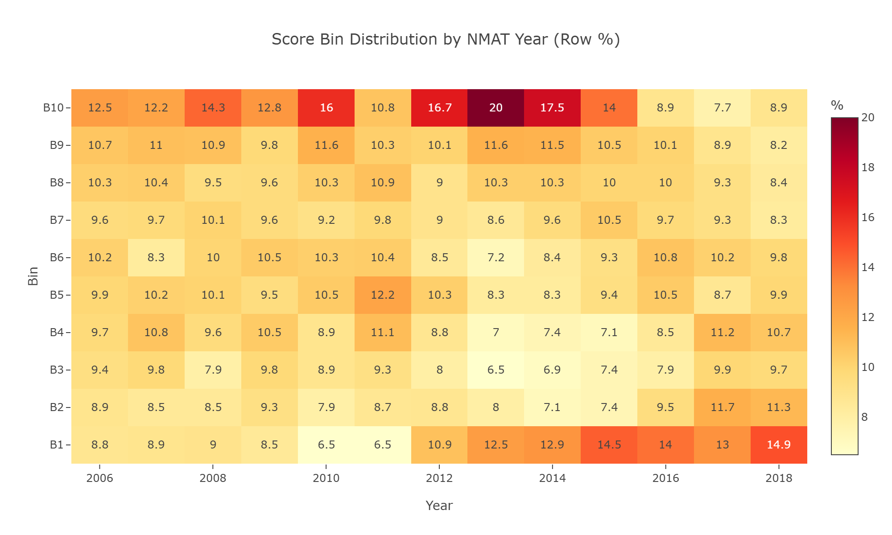

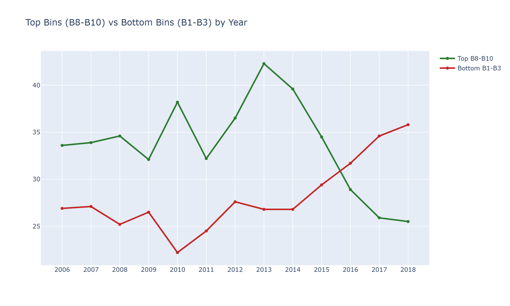

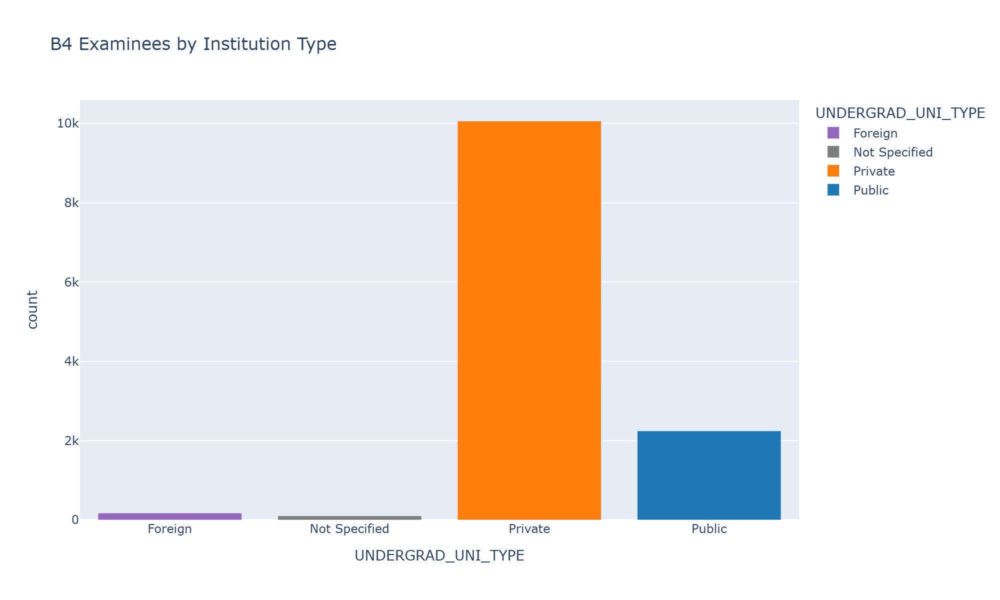

# Tab 3 — PLE-Passer Linkage

## PLE Linkage by Score Bin

<!-- chart_type: bar | x: PercentileBin | y: Linkage Rate (%) | series: none
     population: observable cohort
     n: 68,173 | denominator: observable-cohort examinees with a valid percentile bin
     source_tab: 3 | element_id: ched_t3_fig1 -->

| PercentileBin   | Range   |     N |   Confirmed |   Linkage Rate (%) |
|:----------------|:--------|------:|------------:|-------------------:|
| B1              | 0-9     | 6,853 |         795 |               11.6 |
| B2              | 10-19   | 5,884 |       1,336 |               22.7 |
| B3              | 20-29   | 5,813 |       1,703 |               29.3 |
| B4              | 30-39   | 6,473 |       2,330 |                 36 |
| B5              | 40-49   | 6,582 |       3,003 |               45.6 |
| B6              | 50-59   | 6,284 |       3,168 |               50.4 |
| B7              | 60-69   | 6,359 |       3,407 |               53.6 |
| B8              | 70-79   | 6,704 |       3,690 |                 55 |
| B9              | 80-89   | 7,263 |       4,474 |               61.6 |
| B10             | 90-100  | 9,958 |       7,073 |                 71 |
**Two caveats apply to this gradient, not one.** (1) *Admission selection:* examinees scoring lower on the NMAT were, on average, less likely to be admitted anywhere under the historical, non-uniform cutoffs individual schools actually applied, so lower linkage at the low end reflects **non-admission for at least part of the population, not solely lower ability or a lower chance of passing PLE had they been admitted.** (2) *Matching artefact, now corrected:* the PLE-matching pipeline's name-collision disambiguator previously applied a hard 40th-percentile floor when choosing among multiple same-name candidates, discarding candidates below percentile 40 and rejecting the match outright if none scored at or above 40 -- confined to name-collision groups (unique-name matches were never affected). This has been corrected upstream; every figure below reflects the corrected matcher. Note that the gradient does **not** show a sharp, isolated break at the 40th-percentile boundary -- the B4->B5 step is comparable in size to the B1->B2 and B9->B10 steps, i.e. the increase is roughly continuous across bins, not concentrated at one threshold. Neither this gradient nor any single step in it should be read as evidence about what a *new* cutoff would produce.

---

## Score Profile by PLE Status

|                        |   ('TotalRawScoreTRUE', 'count') |   ('TotalRawScoreTRUE', 'median') |   ('TotalRawScoreTRUE', 'mean') |   ('TotalRawScoreTRUE', '<lambda_0>') |   ('TotalRawScoreTRUE', '<lambda_1>') |   ('NMS_PER_num', 'count') |   ('NMS_PER_num', 'median') |   ('NMS_PER_num', 'mean') |   ('NMS_PER_num', '<lambda_0>') |   ('NMS_PER_num', '<lambda_1>') |   ('PartIRawScoreTRUE', 'count') |   ('PartIRawScoreTRUE', 'median') |   ('PartIRawScoreTRUE', 'mean') |   ('PartIRawScoreTRUE', '<lambda_0>') |   ('PartIRawScoreTRUE', '<lambda_1>') |   ('PartIIRawScoreTRUE', 'count') |   ('PartIIRawScoreTRUE', 'median') |   ('PartIIRawScoreTRUE', 'mean') |   ('PartIIRawScoreTRUE', '<lambda_0>') |   ('PartIIRawScoreTRUE', '<lambda_1>') |
|:-----------------------|---------------------------------:|----------------------------------:|--------------------------------:|--------------------------------------:|--------------------------------------:|---------------------------:|----------------------------:|--------------------------:|--------------------------------:|--------------------------------:|---------------------------------:|----------------------------------:|--------------------------------:|--------------------------------------:|--------------------------------------:|----------------------------------:|-----------------------------------:|---------------------------------:|---------------------------------------:|---------------------------------------:|
| No confirmed PLE match |                           37,888 |                               114 |                           116.2 |                                    94 |                                   136 |                     37,758 |                          38 |                      42.1 |                              15 |                              66 |                           37,888 |                                62 |                            61.9 |                                    51 |                                    73 |                            37,888 |                                 52 |                             54.3 |                                     42 |                                     65 |
| Confirmed PLE passer   |                           31,572 |                               139 |                             141 |                                   120 |                                   162 |                     30,988 |                          69 |                      64.6 |                              45 |                              88 |                           31,572 |                                74 |                            73.8 |                                    63 |                                    84 |                            31,572 |                                 66 |                             67.2 |                                     55 |                                     79 |

---

## PLE-Passer Linkage by NMAT Year

<!-- chart_type: line | x: Year | y: Linkage Rate (%) | series: none
     population: observable cohort by year
     n: 69,503 | denominator: observable-cohort examinees
     source_tab: 3 | element_id: ched_t3_fig2 -->

|   Year |      N |   Confirmed |   Median_percentile |   Linkage Rate (%) |
|-------:|-------:|------------:|--------------------:|-------------------:|
|  2,006 |  3,698 |       2,005 |                  53 |               54.2 |
|  2,007 |  3,690 |       1,832 |                  52 |               49.6 |
|  2,008 |  4,965 |       2,583 |                  54 |                 52 |
|  2,009 |  7,461 |       3,757 |                  52 |               50.4 |
|  2,010 |  8,623 |       4,534 |                  57 |               52.6 |
|  2,011 |  8,842 |       3,918 |                  52 |               44.3 |
|  2,012 |  9,405 |       4,006 |                  52 |               42.6 |
|  2,013 |  9,867 |       4,210 |                  55 |               42.7 |
|  2,014 | 12,952 |       4,736 |                  49 |               36.6 |

---

## PLE-Passer Linkage by Course Group

| UNDERGRAD_COURSE_GROUP       |      N |   Confirmed |   Median_percentile |   Linkage Rate (%) |
|:-----------------------------|-------:|------------:|--------------------:|-------------------:|
| Education                    |  3,188 |       1,699 |                  53 |               53.3 |
| Engineering & Technology     |    318 |         118 |                  71 |               37.1 |
| Medical & Allied             | 38,144 |      17,833 |                  48 |               46.8 |
| Natural Sciences             | 16,512 |       6,994 |                  63 |               42.4 |
| Other                        |  6,612 |       3,201 |                  55 |               48.4 |
| Social & Behavioral Sciences |  4,729 |       1,736 |                  63 |               36.7 |

---

## PLE-Passer Linkage by University Type

| UNDERGRAD_UNI_TYPE   |      N |   Confirmed |   Median_percentile |   Linkage Rate (%) |
|:---------------------|-------:|------------:|--------------------:|-------------------:|
| Foreign              |  1,159 |         258 |                  57 |               22.3 |
| Private              | 52,821 |      23,757 |                  50 |                 45 |
| Public               | 14,642 |       7,226 |                  66 |               49.4 |
Reflects the examinee's undergraduate institution type. No medical-school identifier exists in this dataset.

---

## Stress-Test: Defensible PLE Matching Subset

NOT the tautology in the prior version of this dashboard (which pre-filtered the population on the same flag used to compute 'confirmed', guaranteeing 100% linkage every year regardless of match quality). Population here is the Filipino, B5+ observable cohort with no pre-filter on match status; 'confirmed' additionally requires a >=5-year NMAT-to-PLE gap. This is a genuine, non-tautological check.

| Metric | Value | Population | Note |
|---|---|---|---|
| B5+ Filipino population | 41,289 | Filipino, observable, B5+ | not pre-filtered on match status |
| Confirmed under strict criteria | 23,128 | same population | confirmed + >=5yr gap |
| Strict-criteria linkage rate | 56.0% | same population | genuinely can be <100% |
| Median PLE year gap | 6 yrs | confirmed subset | - |

### Yearly Linkage Rate (Strict-Criteria Subset, B5+, Filipino)

<!-- chart_type: line | x: Year | y: Linkage Rate (%) | series: none
     population: Filipino, observable, B5+, strict criteria
     n: 41,289 | denominator: Filipino B5+ observable examinees
     source_tab: 3 | element_id: ched_t3_fig3 -->

|   Year |   Total |   Confirmed (strict) |   No match |   Linkage Rate (%) |
|-------:|--------:|---------------------:|-----------:|-------------------:|
|  2,006 |   2,251 |                1,374 |        877 |                 61 |
|  2,007 |   2,148 |                1,240 |        908 |               57.7 |
|  2,008 |   3,092 |                1,891 |      1,201 |               61.2 |
|  2,009 |   4,498 |                2,583 |      1,915 |               57.4 |
|  2,010 |   5,723 |                3,469 |      2,254 |               60.6 |
|  2,011 |   5,437 |                2,890 |      2,547 |               53.2 |
|  2,012 |   5,524 |                2,991 |      2,533 |               54.1 |
|  2,013 |   5,784 |                3,210 |      2,574 |               55.5 |
|  2,014 |   6,832 |                3,480 |      3,352 |               50.9 |

### Strict-Criteria B5+ Confirmed Passers by University Type

| UNDERGRAD_UNI_TYPE   |      N |   Share (%) |
|:---------------------|-------:|------------:|
| Foreign              |    167 |         0.7 |
| Not Specified        |    258 |         1.1 |
| Private              | 16,937 |        73.2 |
| Public               |  5,766 |        24.9 |
Under strict matching criteria, 23,128 of 41,289 (56.0%) Filipino B5+ observable examinees are confirmed PLE passers with a >=5-year gap. This is a real, checkable comparison, not a tautology.

---

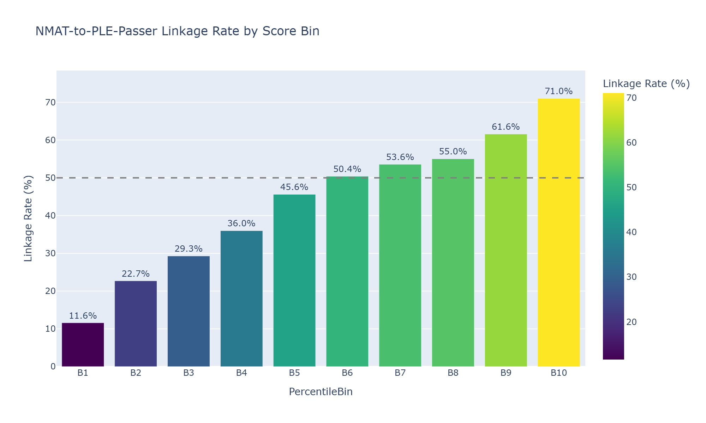

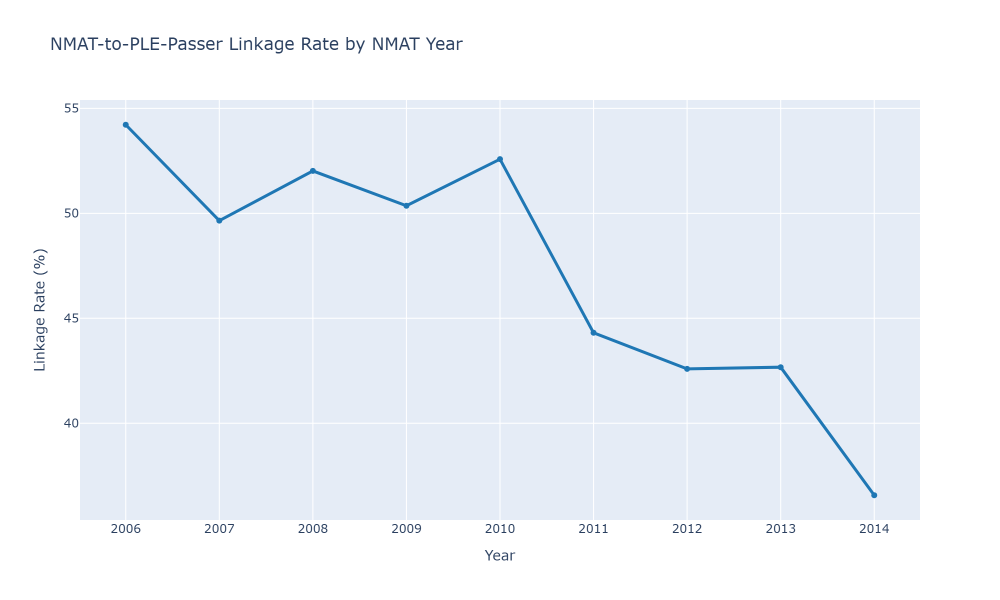

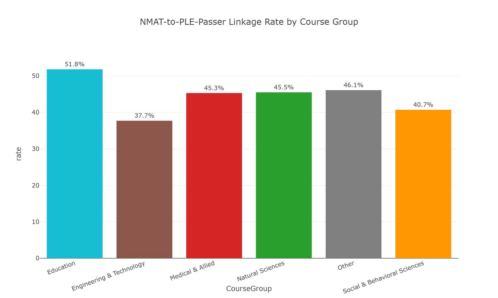

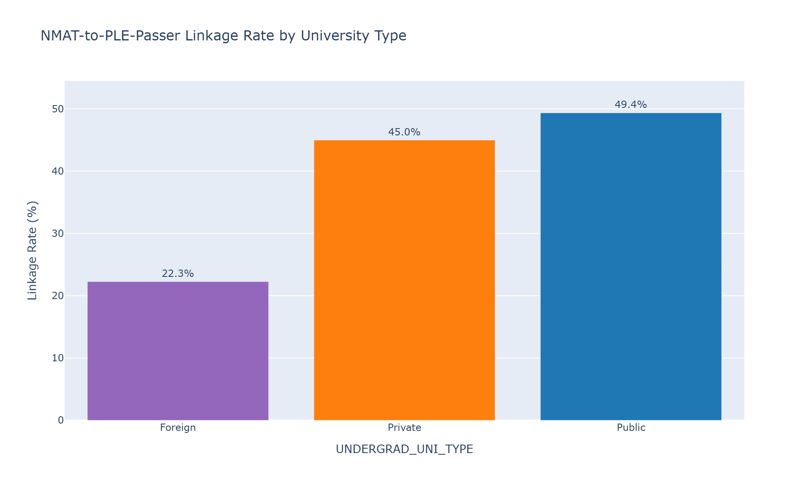

# Tab 4 — Institution and Foreign Context

## Score Summary by University Type

| UNDERGRAD_UNI_TYPE   |   N (best record, valid bin) |   Median %ile |   Q25 %ile |   Q75 %ile |   Median TRUE raw score |   Median GPS |
|:---------------------|-----------------------------:|--------------:|-----------:|-----------:|------------------------:|-------------:|
| Foreign              |                        1,860 |            52 |         21 |         79 |                     124 |        504.5 |
| Private              |                      101,400 |            49 |         23 |         75 |                     121 |          498 |
| Public               |                       27,234 |            57 |         27 |         83 |                     127 |          518 |
Percentile medians use the same population as Tab 2/Tab 5 (best-record examinees with a valid percentile bin) — one null-handling policy shared across this document.

---

## Percentile Rank Distribution by University Type (Box Plot Data)

Five-number summary + n, not raw points, per export contract Rule 1.

| Group   |       N |   Minimum |   Q25 |   Median |   Q75 |   Maximum |
|:--------|--------:|----------:|------:|---------:|------:|----------:|
| Public  |  27,234 |         0 |    27 |       57 |    83 |        99 |
| Private | 101,400 |         0 |    23 |       49 |    75 |        99 |
| Foreign |   1,860 |         0 |    21 |       52 |    79 |        99 |

---

## Score Bin Distribution by University Type

| UNDERGRAD_UNI_TYPE   |   B1 |   B2 |   B3 |   B4 |   B5 |   B6 |   B7 |   B8 |   B9 |   B10 |
|:---------------------|-----:|-----:|-----:|-----:|-----:|-----:|-----:|-----:|-----:|------:|
| Foreign              | 14.1 |  9.3 |  7.5 |  9.5 |  7.8 |  8.8 |  8.7 |  9.4 | 10.6 |  14.3 |
| Private              |   12 |  9.7 |    9 |  9.9 |  9.9 |  9.9 |  9.5 |  9.7 |  9.7 |  10.6 |
| Public               | 10.8 |  8.2 |  7.6 |  8.2 |  8.5 |  8.9 |  9.1 |  9.6 | 11.2 |  17.9 |

---

## Top-Bin Share (B8-B10) by University Type

| UNDERGRAD_UNI_TYPE   |   Total examinees |   Top B8-B10 count |   Top B8-B10 (%) |
|:---------------------|------------------:|-------------------:|-----------------:|
| Private              |           101,400 |             30,459 |             30.1 |
| Foreign              |             1,860 |                638 |             34.3 |
| Public               |            27,234 |             10,533 |             38.7 |

---

## Foreign Examinee Context

| Metric | Value | Population | Note |
|---|---|---|---|
| Verified Foreign NMAT examinees | 24,069 | best-record examinees | - |
| Filipino examinees | 110,787 | best-record examinees | - |
| Distinct foreign nationalities | 89 | best-record, verified foreign | - |

### Top 10 Nationalities

<!-- chart_type: bar | x: Nationality | y: Count | series: none
     population: verified foreign, best-record
     n: 24,069 | denominator: ALL verified-foreign best-record examinees (not top-10 subtotal)
     source_tab: 4 | element_id: ched_t4_fig1 -->

|   Rank | Nationality           |   Count |   Share of verified foreigners (%) |
|-------:|:----------------------|--------:|-----------------------------------:|
|      1 | India                 |  19,090 |                               79.3 |
|      2 | Thailand              |     924 |                                3.8 |
|      3 | Nepal                 |     823 |                                3.4 |
|      4 | United States         |     767 |                                3.2 |
|      5 | Nigeria               |     462 |                                1.9 |
|      6 | Sri Lanka             |     245 |                                  1 |
|      7 | Korea (South)         |     196 |                                0.8 |
|      8 | Iran                  |     144 |                                0.6 |
|      9 | Foreign (unspecified) |     138 |                                0.6 |
|     10 | Indonesia             |     107 |                                0.4 |
Share is of all 24,069 verified foreigners, never the top-10 subtotal (the prior version of this export divided by the subtotal, inflating every row ~4%). 'Foreign (unspecified)' is an unresolved citizenship bucket, not a country.

These are NMAT examinees, not enrolled medical students.

---

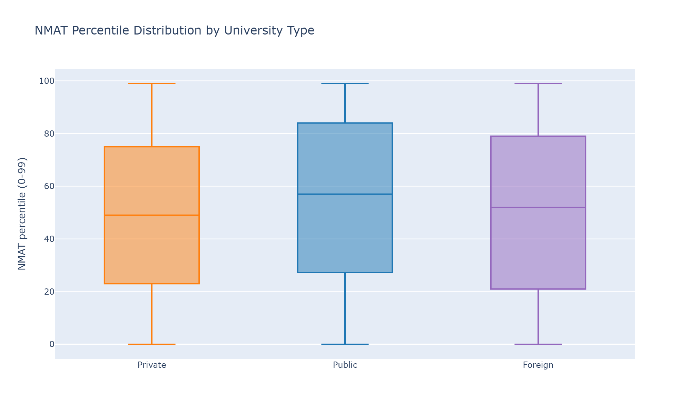

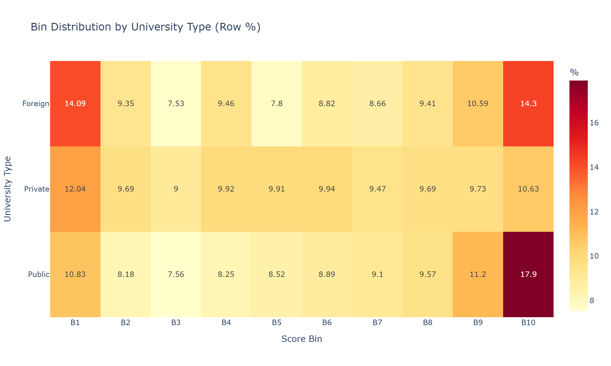

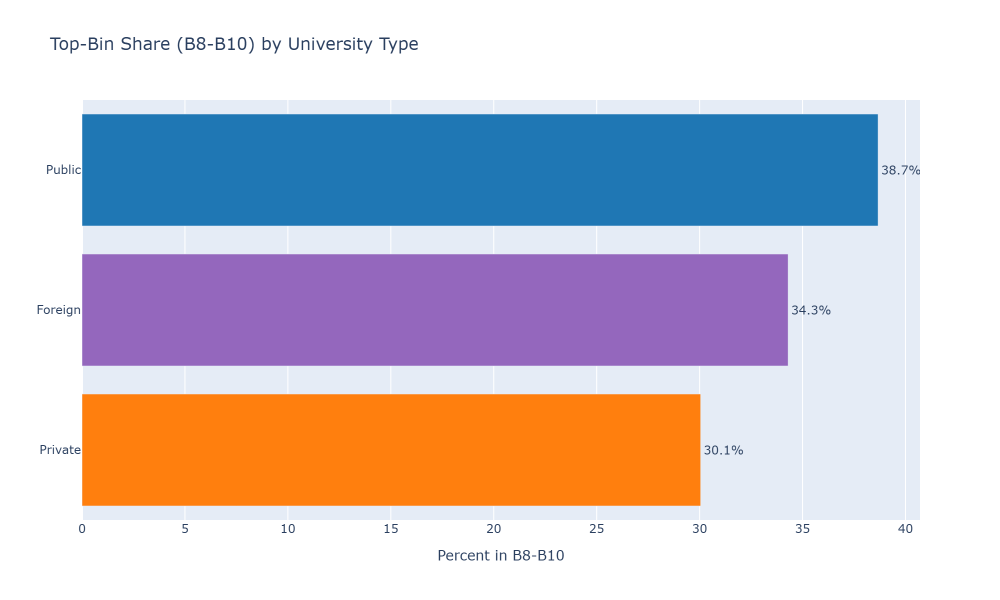

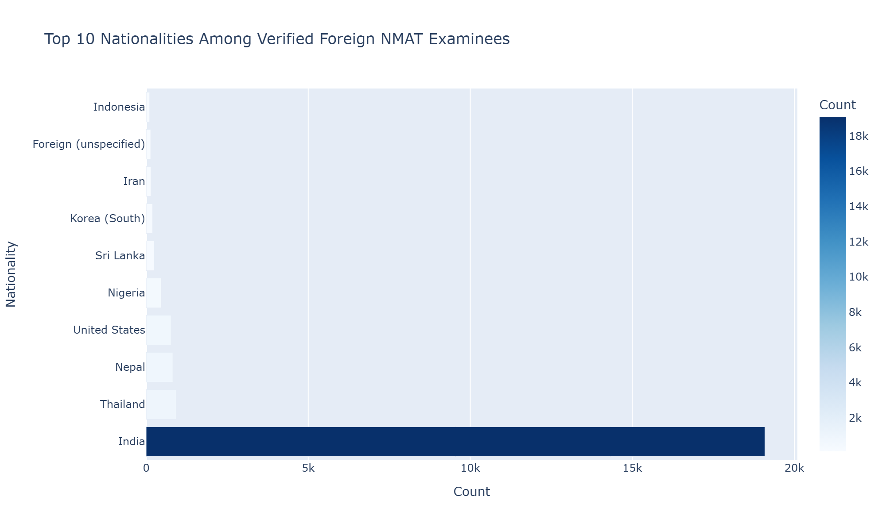

# Tab 5 — Key Evidence for Policy Review

The following findings are descriptive observations based on historical NMAT data (2006-2018). They do not constitute regulatory recommendations.

---

### National Threshold Context

The historical NMAT examinee pool ranges from approximately 70% meeting a B4+ threshold to 61% meeting a B5+ threshold (best-record examinees with a valid percentile bin, 2006-2018).  The marginal group between the two thresholds -- B4 only -- accounts for roughly 9 percentage points of the examinee population.

### Institutional Performance Patterns

Public-undergraduate-institution examinees show a higher median NMAT percentile (57) than private-undergraduate-institution examinees (49).  This pattern is consistent across all NMAT years and may reflect differences in pre-medical preparation, admission selectivity, or other institutional factors not captured in this dataset.  'Institution' here means the undergraduate school, not the medical school. **No medical-school identifier exists in this dataset.** `UNDERGRAD_UNI_TYPE` records the examinee's *undergraduate* institution, not the medical school they attended, and cannot serve as a proxy for CMO §IV.B's SUC-vs-PHEI distinction or for GIDA/IP disadvantage status. No PHEI-level, SUC-vs-PHEI, or per-institution PLE-performance claim can be made from any column in this file.

### NMAT-to-PLE-Passer Linkage Gradient

NMAT-to-PLE-passer linkage rises roughly continuously with score bin, from 12% in the lowest bin (B1) to 71% in the highest bin (B10).  This historical gradient provides context for evaluating the relationship between NMAT scores and licensure outcomes, but is not a PLE pass rate. **Two caveats apply to this gradient, not one.** (1) *Admission selection:* examinees scoring lower on the NMAT were, on average, less likely to be admitted anywhere under the historical, non-uniform cutoffs individual schools actually applied, so lower linkage at the low end reflects **non-admission for at least part of the population, not solely lower ability or a lower chance of passing PLE had they been admitted.** (2) *Matching artefact, now corrected:* the PLE-matching pipeline's name-collision disambiguator previously applied a hard 40th-percentile floor when choosing among multiple same-name candidates, discarding candidates below percentile 40 and rejecting the match outright if none scored at or above 40 -- confined to name-collision groups (unique-name matches were never affected). This has been corrected upstream; every figure below reflects the corrected matcher. Note that the gradient does **not** show a sharp, isolated break at the 40th-percentile boundary -- the B4->B5 step is comparable in size to the B1->B2 and B9->B10 steps, i.e. the increase is roughly continuous across bins, not concentrated at one threshold. Neither this gradient nor any single step in it should be read as evidence about what a *new* cutoff would produce.

### The 40th-Percentile Floor Was Not Uniformly Binding

**The 40th-percentile floor was not uniformly binding historically.** Under a strictly enforced 40th-percentile rule, confirmed PLE passers scoring below that floor (bins B1-B3) should barely exist. They do not: 11.6% of B1 (lowest-decile) examinees and 36.0% of B4 examinees in the observable cohort are confirmed PLE passers (795 confirmed passers in B1 alone). This implies the existing rule -- and by extension any single hard percentile floor -- was not uniformly applied or uniformly binding across the schools examinees actually attended between 2006 and 2014, which bears directly on CMO §IV.B.1's proposal to condition a PHEI's cut-off privilege on a single threshold.

### Historical Linkage Trends

The observable NMAT-to-PLE-passer linkage rate went from 54.2% in 2006 to 36.6% in 2014 across the observable cohort.  The 5-year rolling average was 43.7% as of 2014.  This measure reflects NMAT examinees later matched to PLE passer records and is not directly comparable to official PLE passing rates.  Later years have a shorter observed window for a match to appear even within the observable cohort, which can mechanically lower recent-year rates.

### Public-Institution Threshold Attainment (Descriptive Only)

65.2% of public-undergraduate-institution examinees (17,752 of 27,234) score at Bin 5 or above; only 8.3% fall in the B4-only band the CMO exception addresses.  This is purely descriptive.  Whether this band overlaps with GIDA/IP applicants cannot be determined from this dataset -- GIDA/IP status is not recorded, and 'public undergraduate institution' is neither a GIDA/IP indicator nor equivalent to 'SUC' as the CMO uses the term.  No claim about who benefits from the exception can be supported by this data.

### PLE Matching Sensitivity Check

Restricting to the strictest defensible PLE match (confirmed passer, >=5-year gap, Filipino nationals, B5+ band) yields a linkage rate of 56.0% (23,128 of 41,289) -- genuinely lower than the broader B5+ linkage figures, because this population is not pre-filtered on match status.  This is a real, checkable comparison, not a tautology: it shows that loosening match criteria measurably raises the apparent linkage rate, which should be kept in mind when reading the less-strict figures elsewhere in this dashboard.

### Foreign Examinee Presence

Foreign nationals represent approximately 18.2% of all NMAT records (32,501 verified foreign records out of 178,927 total).  India accounts for the largest share of foreign examinees.  These are NMAT examinee counts, not enrolled medical students.

---

**Note on data scope.** These findings are limited to the NMAT examinee population captured in NMAT_Exodus.parquet. Key gaps include PLE failure rates (only passers are identifiable), GIDA/IP status, medical school admissions and enrollment figures, and institutional admission criteria. No medical-school identifier exists in this dataset at all.

# Tab 6 — Data, Methods, and Limitations

## Dataset Overview

| Metric | Value | Population | Note |
|---|---|---|---|
| Source file | NMAT_Exodus.parquet (53 columns) | - | - |
| Total rows | 178,927 | all NMAT sittings | - |
| Examination years | 2006-2018 | - | - |
| Unique examinees (best record) | 134,869 | one row per person | - |
| Observable PLE cohort | 69,503 | best attempt with Year<=2014 | IS_BEST_OBSERVABLE_RECORD, not best-record & Year<=2014 |
| Repeat takers | 33,713 (25%) | unique examinees | - |
**Data quality note:** 6,148 PERSON_KEY identifiers have contradictory SEX recorded across their rows (PERSON_KEY_AMBIGUOUS), indicating a possible identity collision. Disclosed, not silently corrected.

---

## TRUE Raw Score Recalculation

Of the 99,316 records that carry a stored total, 56,065 (56.5%) disagreed with the sum of the 8 component subtest scores (31.3% of all 178,927 records) and were corrected. Computed live from StoredVsDerivedMismatch, never hardcoded.

| Metric | Value | Population | Note |
|---|---|---|---|
| Rows with complete TRUE scores | 178,882 (99.97%) | all rows | - |
| Stored-total mismatches | 56,065 of 99,316 | rows with a stored total | 56.5% |

---

## Best-Record Deduplication

33,713 examinees (25%) took the NMAT more than once (up to 9 attempts). IS_BEST_NMAT_RECORD selects, for every person, the single attempt with the highest NMAT percentile, latest year as tiebreaker, then lowest application number — one uniform rule for passers and non-passers alike.

---

## Observable Cohort Definition

PLE-linked analyses use IS_BEST_OBSERVABLE_RECORD (each person's best attempt among rows with Year<=2014) — deliberately not the same as filtering the overall best-record flag to Year<=2014, which would silently drop people whose overall-best attempt fell after 2014 and inflate the observed linkage rate.

| Metric | Value | Population | Note |
|---|---|---|---|
| Observable cohort | 69,503 | best attempt within window | - |
| Median NMAT-to-PLE year gap | 6 years | confirmed passers | - |

---

## Deterministic PLE Matching

All PLE matching is deterministic; no fuzzy/rapidfuzz matching is used. PLE_MATCH_OUTCOME breakdown (all rows): accepted 49,086, rejected_ambiguous_person 8,216 (a name-collision candidate found but rejected as genuinely ambiguous, distinguished from a bare no_match), no_match 121,623. PLE_YEAR_UNCERTAIN flags 110 confirmed passers whose PLE year is not determinable (still counted as passers, excluded from year-specific figures). PLE_YEAR_PASSED / PLE_MATCH_METHOD / PLE_YEAR_GAP are diagnostic metadata, not authoritative passer counts, and do not nest inside IS_PLE_PASSER: non-null for 54,529 / 57,304 / 46,219 rows respectively.

| Metric | Value | Population | Note |
|---|---|---|---|
| Confirmed PLE passers (all rows) | 49,086 | all rows | IS_PLE_PASSER |
| Confirmed PLE passers (observable cohort) | 31,581 | observable cohort | - |
**PLE-matching bias against below-40th-percentile examinees (disclosed).** Found during remediation. The name-collision disambiguator (`2_PLE_Matching_Pipeline.ipynb`, `disambiguate()` Step 4) previously applied a hard filter — not a tie-break — discarding every candidate scoring below the 40th NMAT percentile and rejecting the match outright if no candidate scored at or above 40. That constant, 40, is exactly the CMO threshold this dashboard evaluates. The effect is confined to name-collision groups (unique-name matches were never affected, which is why B1-B4 confirmed passers exist at all), now corrected upstream, but present in every below-B4/B5 linkage figure in this document.

---

## Limitations Relevant to CHED Decision-Making

### PLE Outcomes

The dataset only identifies NMAT examinees later matched to PLE passer records.  It does not contain all PLE takers or PLE failures.  Therefore, this dashboard reports NMAT-to-PLE-passer linkage rates, not PLE pass rates.  Official PLE passing rates published by the PRC should be used for benchmarking purposes.

### GIDA and IP Status

The dataset does not contain indicators for Geographically Isolated and Disadvantaged Area (GIDA) residence or Indigenous Peoples (IP) membership.  The CMO exception for 30th-39th percentile applicants from these groups requires documentation not available in this dataset.

### Medical School Admissions and Enrollment

This dataset records NMAT examinees, not enrolled medical students.  The number of examinees at or above a threshold represents the available applicant pool, not actual enrollment.  HEI-level admissions decisions, capacity constraints, and selection criteria are not captured.

### Foreign Student Enrollment Cap

The CMO caps foreign student enrollment at 10 slots per incoming class at SUCs.  The dataset shows NMAT examinees by citizenship, not enrolled foreign students.  A descriptive foreign-examinee profile is provided, but this dashboard does not assess compliance with the 10-slot cap.

### Composite Ranking for Foreign Applicants

The CMO encourages composite ranking for foreign applicants.  The dataset does not contain GWA, interview scores, or other admission criteria needed for such analysis.

### PHEI Accountability and Sanctions

The CMO ties cut-off privileges to a PHEI's own 5-year PLE performance and provides for revocation after three consecutive years below benchmark.  **This dataset contains no medical-school identifier of any kind** -- not just an incomplete one.  No PHEI, SUC, or any other institution-level PLE performance, compliance label, or risk rating can be computed from any column in this file.  `UNDERGRAD_UNI_TYPE` describes the examinee's undergraduate school and must never be read as a stand-in for the medical school the CMO's cut-off privilege provisions are about.

### Selection Effect Across the Linkage Gradient

Linkage rises roughly continuously with score bin (11.6% at B1 to 71.0% at B10) -- there is NOT a sharp, isolated break concentrated at the 40th-percentile boundary; the B4->B5 step (36.0% to 45.6%) is comparable in size to the steps on either side of it. Lower linkage at the low end reflects, in part, non-admission under the historical, non-uniform cutoffs individual schools actually applied between 2006 and 2014 -- not solely lower ability or a lower chance of passing PLE had those examinees been admitted. This gradient cannot be used to estimate how many additional PLE passers a new uniform cutoff would produce or exclude.

### The 40th-Percentile Floor Was Not Uniformly Binding (Disclosed)

**The 40th-percentile floor was not uniformly binding historically.** Under a strictly enforced 40th-percentile rule, confirmed PLE passers scoring below that floor (bins B1-B3) should barely exist. They do not: 11.6% of B1 (lowest-decile) examinees and 36.0% of B4 examinees in the observable cohort are confirmed PLE passers (795 confirmed passers in B1 alone). This implies the existing rule -- and by extension any single hard percentile floor -- was not uniformly applied or uniformly binding across the schools examinees actually attended between 2006 and 2014, which bears directly on CMO §IV.B.1's proposal to condition a PHEI's cut-off privilege on a single threshold.

### PLE-Matching Bias Against Below-40th-Percentile Examinees (Disclosed, Now Corrected)

Found during remediation, not in the original audit. The PLE-matching pipeline's name-collision disambiguator (`2_PLE_Matching_Pipeline.ipynb`, `disambiguate()` Step 4) previously applied a **hard filter**, not a tie-break: when a person's name matched more than one candidate NMAT record, every candidate scoring below the 40th NMAT percentile was discarded outright, and the match was rejected entirely if no candidate scored at or above 40. That constant -- 40 -- is exactly the CMO threshold this dashboard is evaluating. The effect was confined to name-collision groups (unique-name matches were never affected) and has now been corrected upstream -- every number in this dashboard reflects the corrected matcher. `PLE_MATCH_OUTCOME` additionally distinguishes matches rejected as genuinely ambiguous (8,216 candidates, `rejected_ambiguous_person`) from `no_match`, so a reader can see where borderline candidates went rather than have them silently folded into 'no match'. `PLE_YEAR_UNCERTAIN` flags 110 confirmed passers whose PLE year is not determinable; these remain counted as passers but are excluded from any year-specific figure.

# Export Integrity

| check | result |
|---|---|
| Source parquet md5 | 28b85ac53af13b4a2ef3ee93527c97c1 |
| Rows / cols | 178,927 / 53 |
| Tabs exported | 6 / 6 |
| Charts exported as data | 15 / 15 |
| Tables exported | 34 |
| Captions exported | 41 |
| Dashboard-vs-export value assertions passed | 5 / 5 |